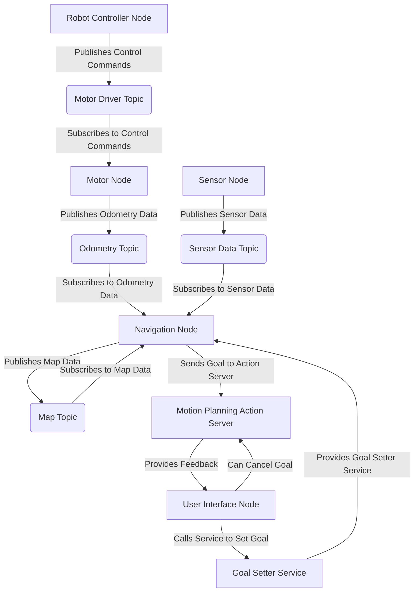

# File: F:\Github\spec-driven-online-hackathon-1\docs\capstone\evaluation.mdx
---
sidebar_position: 4
---

# Capstone Project Evaluation Criteria

The Capstone Project serves as the ultimate demonstration of a learner's mastery of the concepts and skills acquired throughout the "Physical AI & Humanoid Robotics Course." This document outlines the clear evaluation criteria used to assess the project's success, focusing on functionality, robustness, adherence to requirements, and the quality of technical documentation.

## 1. Overall Evaluation Objectives

The Capstone Project evaluation aims to:
*   Verify the successful integration of all learned modules (ROS 2, Digital Twin, AI-Robot Brain, VLA Robotics).
*   Assess the learner's ability to apply theoretical knowledge to a practical, autonomous robotics task.
*   Determine the project's functionality and robustness in a simulated environment.
*   Evaluate the clarity and completeness of the learner's technical documentation and code.

## 2. Functional Requirements (40% of Score)

Assessment of whether the autonomous humanoid successfully performs the core tasks as specified in the Capstone Project narrative (`overview.mdx`).

### 2.1. Voice Input Pipeline (FR-CAP-002)
*   **Criterion**: The system can correctly interpret a defined set of voice commands.
*   **Assessment**: Successful conversion of voice commands to text and subsequent high-level instruction interpretation by an LLM.

### 2.2. Cognitive Planning Pipeline (FR-CAP-003)
*   **Criterion**: The system can break down complex high-level commands into a logical sequence of sub-tasks.
*   **Assessment**: Demonstration of a valid action sequence generated by the planner in response to a complex command.

### 2.3. Navigation Pipeline (FR-CAP-004)
*   **Criterion**: The humanoid can autonomously navigate to specified locations within the simulated environment.
*   **Assessment**: Accurate movement to target waypoints, obstacle avoidance, and path adherence.

### 2.4. Object Identification & Manipulation Pipeline (FR-CAP-005)
*   **Criterion**: The humanoid can identify target objects visually and perform successful manipulation (e.g., pick, place).
*   **Assessment**: Correct object recognition, successful grasping, precise placement, and smooth arm movements.

## 3. Robustness and Error Handling (30% of Score)

Assessment of the project's stability, reliability, and ability to handle unexpected situations within the simulated environment.

*   **Criterion**: The system exhibits stable behavior under varying conditions (e.g., slight object displacement, minor sensor noise).
*   **Assessment**: Minimal failures during repeated task executions; graceful recovery from minor perturbations; absence of unhandled exceptions or crashes.
*   **Criterion**: Appropriate error detection and (conceptual) recovery mechanisms are in place for failed sub-tasks (e.g., failed grasp, navigation timeout).
*   **Assessment**: Logging of errors; conceptual re-planning or retry mechanisms when a sub-task fails.

## 4. Code Quality and Documentation (20% of Score)

Assessment of the clarity, structure, and maintainability of the codebase, along with the completeness of the project documentation.

*   **Criterion**: Code is well-structured, modular, and adheres to Python best practices (PEP 8).
*   **Assessment**: Clear function/class design; appropriate use of comments; readable variable names.
*   **Criterion**: ROS 2 nodes follow established conventions (e.g., topic/service naming, message types).
*   **Assessment**: Consistent ROS 2 interface design.
*   **Criterion**: Technical documentation (`overview.mdx`, code comments) clearly explains the design, implementation, and usage of the Capstone project.
*   **Assessment**: Detailed overview, clear setup instructions, explanation of key components and their interactions.

## 5. Innovation and Creativity (10% of Score)

Assessment of any novel approaches, unique features, or extensions beyond the basic requirements.

*   **Criterion**: Demonstrates original thought, creative problem-solving, or advanced application of learned concepts.
*   **Assessment**: Introduction of additional features (e.g., advanced human-robot interaction, multi-robot coordination, more complex perception tasks), or a particularly elegant solution to a challenge.

---

### Final Verdict: "Safe to continue" or "Fix required before Phase 6" (Not Applicable here)
_This section is typically for agent-side assessment. For learners, a score based on the above criteria would be provided._


# File: F:\Github\spec-driven-online-hackathon-1\docs\capstone\overview.mdx
---
title: Capstone Project Overview
description: Design the full Capstone Project narrative and requirements.
sidebar_position: 1
---

# Capstone Project: Autonomous Humanoid for Voice-Commanded Tasks

Welcome to the Capstone Project! This is the culmination of your journey through the Physical AI & Humanoid Robotics Course. In this phase, you will apply all the knowledge and skills gained from Modules 1, 2, 3, and 4 to build a fully autonomous humanoid robot capable of understanding voice commands and executing complex tasks in a simulated environment.

<h2>1. Project Goal</h2>

The primary goal of the Capstone Project is to design, implement, and demonstrate an autonomous humanoid robot that can:

1.  Receive high-level voice commands from a human operator.
2.  Interpret these commands using natural language understanding.
3.  Plan and navigate through a simulated environment.
4.  Identify and locate specific objects.
5.  Perform manipulation tasks (e.g., picking and placing objects).

The project narrative is: **"Autonomous Humanoid receiving voice → planning → navigation → object identification → manipulation"**

<h2>2. Core Pipelines (Integration of Modules)</h2>

The Capstone Project requires the seamless integration of several key pipelines, each building upon the concepts learned in previous modules:

<h3>a) Voice Input Pipeline (Whisper -> LLM -> ROS 2 Actions)</h3>

This pipeline handles the human-robot interface, converting spoken commands into structured robotic instructions.

*   **Voice-to-Text**: Utilize a Speech-to-Text (STT) system (e.g., OpenAI Whisper, as explored in Module 4) to transcribe spoken language into text.
*   **Language Understanding**: Employ a Large Language Model (LLM, as explored in Module 4) to interpret the text, extract intent, and identify relevant entities (objects, locations).
*   **ROS 2 Action Generation**: Translate the LLM's output into a sequence of discrete ROS 2 actions or service calls that the robot can execute.

<h3>b) Cognitive Planning Pipeline</h3>

This pipeline is responsible for breaking down high-level commands into a series of actionable sub-tasks and ensuring their logical execution.

*   **Task Decomposition**: Transform an abstract command (e.g., "get me the cup") into a sequence of more specific actions (e.g., "navigate to table," "find cup," "grasp cup," "return cup").
*   **State Management**: Keep track of the robot's current state, the environment's state, and the progress of the overall task.
*   **Decision Making**: Make decisions at various points in the plan, such as re-planning if an obstacle is encountered or if an object is not found.

<h3>c) Navigation Pipeline (Isaac Sim + Nav2)</h3>

This pipeline enables the humanoid to move autonomously and safely within the simulated environment.

*   **Localization & Mapping**: Use techniques like Visual SLAM (Simultaneous Localization and Mapping), potentially from Isaac Sim's capabilities or external ROS 2 packages, to build a map of the environment and determine the robot's position within it.
*   **Path Planning**: Generate global and local paths to reach target locations while avoiding obstacles. ROS 2 Nav2 stack is a prime candidate for this.
*   **Motion Control**: Execute the planned paths by generating appropriate velocity commands for the robot's base.
*   **Simulation Environment**: All navigation will occur within Isaac Sim, leveraging its physics and rendering capabilities.

<h3>d) Object Identification and Manipulation Pipeline (URDF -> Controllers)</h3>

This pipeline focuses on the robot's ability to interact with objects in its environment.

*   **Object Perception**: Utilize vision systems (e.g., from Isaac ROS or other sources, as explored in Module 3 and 4) to detect, identify, and estimate the 3D pose of target objects.
*   **Reachability Analysis**: Determine if the robot's arm can reach the target object from its current position.
*   **Grasping Strategy**: Plan a stable grasp for the object, considering its geometry and the robot's gripper capabilities.
*   **Manipulation Execution**: Use the robot's URDF model and joint controllers to execute the planned reach and grasp actions.

<h2>3. Capstone Project Requirements</h2>

*   The robot MUST respond to at least three distinct high-level voice commands (e.g., "Pick and Place", "Explore Room", "Follow Me").
*   The robot MUST be able to navigate a predefined simulated environment in Isaac Sim to reach target locations.
*   The robot MUST accurately identify and localize at least two distinct objects.
*   The robot MUST successfully perform pick-and-place manipulation for at least one object.
*   All components MUST be integrated using ROS 2 communication mechanisms.
*   The entire system MUST run robustly in Isaac Sim.

<h2>4. Deliverables</h2>

*   A fully integrated ROS 2 system running in Isaac Sim.
*   Demonstration of the humanoid executing voice-commanded tasks.
*   Codebase for all pipelines.
*   Detailed `docs/capstone/overview.mdx` and `docs/capstone/evaluation.mdx`.

<h2>Conclusion</h2>

The Capstone Project brings together all the complex facets of Physical AI and Humanoid Robotics. Successfully completing this project will demonstrate a comprehensive understanding of ROS 2, advanced simulation, AI perception, natural language processing, and robot control. Good luck!


# File: F:\Github\spec-driven-online-hackathon-1\docs\chat\index.mdx
---
title: RAG Chatbot
sidebar_label: RAG Chatbot
---

# Ask the RAG Chatbot!

This page hosts the RAG Chatbot, providing instant answers to your questions about the "Physical AI & Humanoid Robotics Course" book.

## How to Use:

1.  **Ask a Question**: Type your question in the chat box below and press Enter or click "Send".
2.  **Query Selected Text**: Select any text on the Docusaurus page. (Future: A context menu or button will appear to query the chatbot specifically about your selection.)

<iframe
  src="/chat-widget/"
  width="100%"
  height="600px"
  frameBorder="0"
  style={{ border: '1px solid #ccc', borderRadius: '8px' }}
></iframe>

:::tip Note
The chatbot's knowledge is strictly limited to the content of this book. It cannot answer questions outside of this scope.
:::

## Development Notes:

The iframe points to a static HTML file that is part of the Docusaurus build process.
The `client.js` inside the iframe handles communication with the FastAPI backend.
In a full Docusaurus integration, you would typically configure Docusaurus to copy the `frontend/chat_widget` contents to a static directory accessible via `/chat-widget/`.

To enable the `/chat-widget/` path, ensure your `docusaurus.config.js` or `sidebars.js` (for navigation) is updated, and that the widget files are copied to the `static` directory or served correctly.

Example `docusaurus.config.js` entry (conceptual):
```javascript
module.exports = {
  // ... other configs
  staticDirectories: ['static', 'frontend/chat_widget'], // This line is conceptual
  // ...
};
```
This is a placeholder for `docusaurus.config.js` configuration which would usually be handled directly in the docusaurus configuration files.


# File: F:\Github\spec-driven-online-hackathon-1\docs\contributing\style-guide.mdx
# Content Style Guide

This guide outlines the conventions and best practices for creating content for the "Physical AI & Humanoid Robotics Course" book. Adhering to these guidelines ensures consistency, clarity, and a high-quality learning experience for our readers.

## 1. Docusaurus MDX Workflow

Our book uses Docusaurus, which supports MDX (Markdown with JSX) for content creation. This allows you to embed React components directly within your Markdown files, enabling rich and interactive content.

### File Naming Conventions

*   All content files should use the `.mdx` extension.
*   File names should be `kebab-case` (e.g., `chapter1-introduction-to-ros2.mdx`).
*   Directory names for modules and chapters should also be `kebab-case`.

### Front Matter

Each MDX file must start with YAML front matter, enclosed by `---`, to define metadata.
Example:

```yaml
---
title: Introduction to ROS 2
description: An overview of ROS 2 concepts and architecture.
sidebar_position: 1
---
```

*   `title`: The title of the page, displayed in the browser tab and sidebar.
*   `description`: A brief summary of the page content, used for SEO and metadata.
*   `sidebar_position`: (Optional) Controls the order of the page in the sidebar. Lower numbers appear higher. If omitted, Docusaurus uses alphabetical order.

### Headings

Use ATX headings (`#`, `##`, `###`, etc.) to structure your content.
*   Only one H1 heading (`#`) per page, which should match the `title` in the front matter.
*   Use H2 (`##`) for major sections, H3 (`###`) for sub-sections, and so on.

### Code Blocks

Use fenced code blocks with language identifiers for syntax highlighting.
Example:

````markdown
```python
def hello_robot():
    print("Hello, robot!")
```
````

For inline code, use backticks (`` ` ``).

### Images and Assets

*   Store images in the `static/assets/` directory or in module-specific `docs/moduleX/assets/` directories.
*   Reference images using relative paths.
    Example: ``
*   For diagrams that can be text-based (like flowcharts or sequence diagrams), prefer Mermaid.js syntax embedded directly in MDX.

### Links

*   Use relative links for internal pages within the Docusaurus site.
    Example: `[Module 1 Introduction](/docs/module1-ros2/chapter1-introduction-to-ros2)`
*   For links to other documents in the same sidebar: `[Next Chapter (example link)]`

## 2. Project-Specific Style Guide

### Tone and Voice

*   **Educational and Formal**: Maintain a clear, concise, and professional tone suitable for an educational textbook.
*   **Encouraging and Accessible**: While formal, the language should be inviting and easy for learners to understand, avoiding overly academic jargon where simpler terms suffice.
*   **Consistent Terminology**: Use consistent terminology throughout the book. Refer to the glossary if available.

### Technical Accuracy

*   All technical explanations, code examples, and simulation instructions must be thoroughly tested and verified for accuracy and reproducibility.
*   Clearly distinguish between theoretical concepts and practical implementation details.

### Code Examples

*   **Readability**: Python code examples should be well-commented, follow PEP 8 guidelines, and be easy to read.
*   **Completeness**: Code examples should be self-contained and runnable where feasible, demonstrating the concept being taught.
*   **Consistency**: Adhere to a consistent coding style across all examples.

### Diagrams and Visuals

*   **Clarity**: Diagrams should convey information clearly and effectively.
*   **Relevance**: Every visual element should serve a specific educational purpose.
*   **Accessibility**: Ensure diagrams are labeled clearly and provide alternative text for accessibility.

### Hands-on Exercises and Simulations

*   Each chapter should include at least one hands-on exercise or simulation task.
*   Instructions for exercises should be precise, step-by-step, and yield reproducible results.

## 3. Review Process

All content will undergo a two-stage review process:
1.  **Technical Review**: Focuses on the accuracy of robotics, AI, and simulation concepts.
2.  **Editorial Review**: Focuses on clarity, consistency, grammar, spelling, and adherence to this style guide.

---

By following this guide, we ensure that the "Physical AI & Humanoid Robotics Course" is a high-quality, effective, and enjoyable learning resource.


# File: F:\Github\spec-driven-online-hackathon-1\docs\deployment\guide.mdx
---
sidebar_position: 1
---

# Deployment and Maintenance Guide

This guide provides instructions for building, deploying, and maintaining the "Physical AI & Humanoid Robotics Course" book, which is built using Docusaurus and hosted on GitHub Pages.

## 1. Building the Project

To build the static website files for the Docusaurus project:

1.  **Ensure Node.js and npm are installed**:
    If not already installed, follow the instructions on [Node.js official website](https://nodejs.org/).

2.  **Install Project Dependencies**:
    Navigate to the root directory of the project in your terminal and run:
    ```bash
    npm install
    ```

3.  **Build the Website**:
    This command compiles the Docusaurus project and generates all static assets into a `build/` directory.
    ```bash
    npm run build
    ```
    Upon successful completion, you will find the static website files in the `build/` directory at the project root.

## 2. Deploying to GitHub Pages

The project is configured for automated deployment to GitHub Pages using GitHub Actions.

### 2.1. Configuration in `docusaurus.config.ts`

Ensure the following fields in your `docusaurus.config.ts` are correctly configured for your GitHub repository:

*   `url`: `https://your-github-username.github.io` (replace `your-github-username` with your actual GitHub username/organization)
*   `baseUrl`: `/spec-driven-online-hackathon-1/` (replace `spec-driven-online-hackathon-1` with your repository name if it's different, or `/` for user/organization pages)
*   `organizationName`: `your-github-username` (your GitHub username/organization)
*   `projectName`: `spec-driven-online-hackathon-1` (your GitHub repository name)
*   `editUrl`: `https://github.com/your-github-username/spec-driven-online-hackathon-1/tree/main/` (update with your actual repo path)

### 2.2. GitHub Actions Workflow (`.github/workflows/deploy.yml`)

The deployment is handled by a GitHub Actions workflow:

*   **Trigger**: The workflow is configured to run automatically on `push` events to the `main` branch.
*   **Steps**:
    *   `actions/checkout@v3`: Checks out your repository.
    *   `actions/setup-node@v3`: Sets up the Node.js environment.
    *   `npm install`: Installs project dependencies.
    *   `npm run build`: Builds the Docusaurus website.
    *   `peaceiris/actions-gh-pages@v3`: Deploys the `build/` directory content to the `gh-pages` branch of your repository.

**To trigger a deployment**:
Simply push changes to your `main` branch. GitHub Actions will pick up the changes, build the site, and deploy it to GitHub Pages.

### 2.3. GitHub Pages Settings

After your first successful deployment, ensure your GitHub repository's Pages settings are configured to serve from the `gh-pages` branch.
1.  Go to your repository on GitHub.
2.  Navigate to **Settings** > **Pages**.
3.  Under "Source", select "Deploy from a branch".
4.  For "GitHub Pages branch", choose `gh-pages` and `/ (root)`.
5.  Click "Save".

Your site should then be accessible at the URL configured in `docusaurus.config.ts`.

## 3. Maintenance and Updates

### 3.1. Content Updates

*   **Editing Content**: Modify `.mdx` files in the `docs/` and `blog/` directories.
*   **Adding New Content**: Create new `.mdx` files and update `_category_.json` files or `sidebars.ts` as needed for navigation.
*   **Assets**: Place new images, diagrams, or other static assets in `static/assets/` or module-specific `assets/` folders.

### 3.2. Dependency Updates

Regularly update Node.js dependencies to benefit from new features, bug fixes, and security patches.
```bash
npm update
```
After updating, always run `npm run build` locally to ensure the site still builds correctly before pushing changes.

### 3.3. Docusaurus Version Updates

Keep Docusaurus updated to the latest stable version. Refer to the [Docusaurus Upgrade Guide](https://docusaurus.io/docs/next/migration) for instructions on migrating between major versions.

## 4. Troubleshooting

*   **Build Failures**:
    *   Check the GitHub Actions workflow logs for specific error messages.
    *   Run `npm run build` locally to reproduce the error and get more detailed diagnostics.
    *   Common issues: broken links, MDX syntax errors, missing dependencies.
*   **Deployment Issues**:
    *   Verify your GitHub Pages settings (branch, source) are correct.
    *   Check the GitHub Actions deployment log for errors.
    *   Ensure the `baseUrl` in `docusaurus.config.ts` matches your GitHub Pages subpath configuration.
*   **Broken Links on Live Site**:
    *   Run `npm run build` locally; `onBrokenLinks` and `onBrokenMarkdownLinks` will help identify issues.
    *   Use Docusaurus's built-in link checker (often part of `npm run build`).
*   **Content Not Appearing/Incorrect Order**:
    *   Verify `sidebar_position` in frontmatter.
    *   Check `_category_.json` and `sidebars.ts` for correct `label` and `dirName`.
    *   Ensure file names and directory names are `kebab-case`.


# File: F:\Github\spec-driven-online-hackathon-1\docs\module1-ros2\chapter1-introduction-to-ros2.mdx
---
title: Introduction to ROS 2
description: An overview of ROS 2 concepts and architecture (nodes, topics, services, actions).
sidebar_position: 1
---

# Introduction to ROS 2: The Robotic Nervous System

Welcome to Module 1! In this module, we will explore the Robotic Operating System 2 (ROS 2), which serves as the "nervous system" for many advanced robotic applications, especially humanoid robots. ROS 2 provides a flexible framework for writing robot software, allowing different components of a robotic system to communicate and work together seamlessly.

## What is ROS 2?

ROS 2 is a set of software libraries and tools that help you build robot applications. From drivers to state-of-the-art algorithms, and with powerful developer tools, ROS has everything you need to start with your next robotics project. The "2" in ROS 2 signifies a significant re-architecture from its predecessor, ROS 1, primarily to support real-time systems, multi-robot systems, and to integrate with modern development practices more effectively.

### Key Concepts

Understanding ROS 2 revolves around several core concepts that facilitate modularity and distributed computing:

#### 1. Nodes

At the heart of ROS 2 are **nodes**. A node is an executable process that performs a specific task. For example, one node might be responsible for reading data from a camera, another for controlling a motor, and yet another for performing path planning. By breaking down complex robot functionalities into smaller, independent nodes, development becomes more manageable, and components can be reused across different projects.

#### 2. Topics

**Topics** are the most common way for nodes to asynchronously communicate with each other. A node can *publish* data to a topic, and other nodes can *subscribe* to that topic to receive the data. This publish-subscribe model is a one-to-many communication mechanism. For instance, a camera node might publish image data to an "image" topic, and an image processing node might subscribe to that topic to receive the images.

*   **Publisher**: A node that sends messages to a topic.
*   **Subscriber**: A node that receives messages from a topic.
*   **Message**: The data structure that is sent over a topic. ROS 2 uses predefined message types, but custom messages can also be created.

#### 3. Services

While topics are excellent for continuous, one-way data streams, sometimes you need a request/reply mechanism. This is where **services** come in. A service allows a node to send a request to another node and wait for a response. This is a synchronous, one-to-one communication pattern, useful for tasks that require a direct action and result, like requesting a robot to move to a specific position and confirming its arrival.

*   **Service Server**: A node that provides a service and processes requests.
*   **Service Client**: A node that sends a request to a service server and waits for a response.

#### 4. Actions

**Actions** are similar to services in that they provide a request/reply pattern, but they also offer continuous feedback and the ability to preempt (cancel) a goal. Actions are designed for long-running tasks, such as navigating a robot through a complex environment. A client can send a goal, receive intermittent feedback on its progress, and even cancel the goal if necessary.

*   **Action Server**: A node that provides an action, processes goals, and sends feedback.
*   **Action Client**: A node that sends a goal to an action server, receives feedback, and can cancel the goal.

## ROS 2 Architecture Overview

The overall architecture of a ROS 2 system often involves a collection of interconnected nodes communicating via topics, services, and actions. This distributed architecture makes ROS 2 highly flexible and scalable, allowing different parts of a robot's software to run on different machines or even different types of hardware.



This diagram illustrates a simplified ROS 2 system, showing how different nodes interact using various communication mechanisms.

## Conclusion

ROS 2 provides a powerful and flexible framework for developing complex robotic applications. By understanding its core concepts—nodes, topics, services, and actions—you gain the foundational knowledge to build and integrate sophisticated functionalities into your humanoid robots. In the next chapters, we will dive deeper into each of these concepts with practical Python examples.


# File: F:\Github\spec-driven-online-hackathon-1\docs\module1-ros2\chapter2-ros2-communication-patterns.mdx
---
title: ROS 2 Communication Patterns
description: Covering publishing/subscribing to topics with Python (rclpy).
sidebar_position: 2
---

# ROS 2 Communication Patterns: Publishing and Subscribing

In the previous chapter, we introduced the fundamental concepts of ROS 2, including nodes and topics. This chapter dives deeper into the most common communication pattern in ROS 2: publishing and subscribing to topics. This asynchronous, one-to-many communication model is crucial for distributing data throughout your robotic system.

## The Publish-Subscribe Model

The publish-subscribe pattern allows different nodes to exchange information without needing direct knowledge of each other. A *publisher* node sends messages to a named *topic*, and any *subscriber* nodes interested in that data can listen to the same topic to receive those messages.

### Key Components

*   **Topic**: A named channel over which messages are exchanged. Think of it as a broadcast channel.
*   **Message**: The actual data structure being sent. Messages have a defined type (e.g., `std_msgs/String`, `sensor_msgs/Image`) that dictates their content.
*   **Publisher**: A node that creates and sends messages to a specific topic.
*   **Subscriber**: A node that listens to a specific topic and processes incoming messages.

## Implementing Publishers in Python (rclpy)

Using `rclpy`, the Python client library for ROS 2, implementing a publisher involves a few key steps:

1.  **Import `rclpy` and message type**: Import the necessary ROS 2 Python client library and the type of message you intend to publish.
2.  **Create a node**: Every ROS 2 component runs within a node.
3.  **Create a publisher**: Instantiate a publisher for a specific topic and message type.
4.  **Publish messages**: Periodically or upon an event, create a message and publish it.

### Pseudo-code for a Simple Publisher

This pseudo-code demonstrates how a node might continuously publish a string message to a topic.

```python
import rclpy
from rclpy.node import Node
from std_msgs.msg import String # Example message type

class SimplePublisher(Node):
    def __init__(self):
        super().__init__('simple_publisher_node')
        self.publisher_ = self.create_publisher(String, 'my_topic', 10) # Topic name, message type, queue size
        timer_period = 0.5  # seconds
        self.timer = self.create_timer(timer_period, self.timer_callback)
        self.i = 0

    def timer_callback(self):
        msg = String()
        msg.data = f'Hello ROS 2 World: {self.i}'
        self.publisher_.publish(msg)
        self.get_logger().info(f'Publishing: "{msg.data}"')
        self.i += 1

def main(args=None):
    rclpy.init(args=args)
    minimal_publisher = SimplePublisher()
    rclpy.spin(minimal_publisher) # Keep node alive until Ctrl+C
    minimal_publisher.destroy_node()
    rclpy.shutdown()

if __name__ == '__main__':
    main()
```

## Implementing Subscribers in Python (rclpy)

Similarly, a subscriber node in `rclpy` performs the following actions:

1.  **Import `rclpy` and message type**: Just like the publisher, import the necessary libraries and the message type it expects to receive.
2.  **Create a node**: All ROS 2 components need a node.
3.  **Create a subscriber**: Instantiate a subscriber for a specific topic and message type, and provide a callback function.
4.  **Process incoming messages**: The callback function will be executed every time a new message is received on the subscribed topic.

### Pseudo-code for a Simple Subscriber

This pseudo-code illustrates a node subscribing to the topic from the `SimplePublisher` and printing the received messages.

```python
import rclpy
from rclpy.node import Node
from std_msgs.msg import String # Example message type

class SimpleSubscriber(Node):
    def __init__(self):
        super().__init__('simple_subscriber_node')
        self.subscription = self.create_subscription(
            String,
            'my_topic', # Must match the publisher's topic name
            self.listener_callback,
            10) # Queue size
        self.subscription  # prevent unused variable warning

    def listener_callback(self, msg):
        self.get_logger().info(f'I heard: "{msg.data}"')

def main(args=None):
    rclpy.init(args=args)
    minimal_subscriber = SimpleSubscriber()
    rclpy.spin(minimal_subscriber) # Keep node alive until Ctrl+C
    minimal_subscriber.destroy_node()
    rclpy.shutdown()

if __name__ == '__main__':
    main()
```

## Conclusion

The publish-subscribe communication pattern is a cornerstone of ROS 2, enabling robust and scalable data flow between decoupled nodes. By mastering the implementation of publishers and subscribers using `rclpy`, you are well on your way to building sophisticated robotic applications. In the next chapter, we will explore synchronous communication using services and actions.


# File: F:\Github\spec-driven-online-hackathon-1\docs\module1-ros2\chapter3-ros2-services-actions.mdx
---
title: ROS 2 Services and Actions
description: Covering calling/providing services and actions with Python (rclpy).
sidebar_position: 3
---

# ROS 2 Services and Actions: Synchronous and Long-Running Communication

In the previous chapter, we explored the asynchronous, one-to-many communication pattern of topics. While topics are excellent for continuous data streams, many robotic tasks require a more direct request-response interaction or involve long-running operations with feedback. This chapter introduces ROS 2 services and actions, which provide these capabilities.

## ROS 2 Services: Synchronous Request/Response

Services enable a synchronous, one-to-one communication pattern. A client sends a request to a service server and blocks until it receives a response. This is ideal for tasks that need an immediate result or confirmation, such as requesting sensor data once, or triggering a specific movement command.

### Implementing Service Servers in Python (rclpy)

To create a service server:

1.  **Import `rclpy` and service type**: Import the necessary ROS 2 Python client library and the service message type (e.g., `example_interfaces.srv.AddTwoInts`).
2.  **Create a node**: Every ROS 2 component runs within a node.
3.  **Define a callback function**: This function will be executed when a request is received, process the request, and return a response.
4.  **Create a service**: Instantiate a service, providing the service type, name, and callback function.

### Pseudo-code for a Simple Service Server

This pseudo-code illustrates a service server that adds two integers.

```python
import rclpy
from rclpy.node import Node
from example_interfaces.srv import AddTwoInts # Example service type

class AddTwoIntsService(Node):
    def __init__(self):
        super().__init__('add_two_ints_server')
        self.srv = self.create_service(AddTwoInts, 'add_two_ints', self.add_two_ints_callback)
        self.get_logger().info('AddTwoInts service server started.')

    def add_two_ints_callback(self, request, response):
        response.sum = request.a + request.b
        self.get_logger().info(f'Incoming request: a={request.a}, b={request.b}. Sending response: {response.sum}')
        return response

def main(args=None):
    rclpy.init(args=args)
    minimal_service = AddTwoIntsService()
    rclpy.spin(minimal_service)
    minimal_service.destroy_node()
    rclpy.shutdown()

if __name__ == '__main__':
    main()
```

### Implementing Service Clients in Python (rclpy)

To create a service client:

1.  **Import `rclpy` and service type**: Similar to the server, import the service message type.
2.  **Create a node**: All ROS 2 components need a node.
3.  **Create a client**: Instantiate a client for the service you want to call.
4.  **Send request and await response**: Create a request, send it, and wait for the synchronous response.

### Pseudo-code for a Simple Service Client

This pseudo-code illustrates a client calling the `AddTwoInts` service.

```python
import rclpy
from rclpy.node import Node
from example_interfaces.srv import AddTwoInts
import sys

class AddTwoIntsClient(Node):
    def __init__(self):
        super().__init__('add_two_ints_client')
        self.cli = self.create_client(AddTwoInts, 'add_two_ints')
        while not self.cli.wait_for_service(timeout_sec=1.0):
            self.get_logger().info('service not available, waiting again...')
        self.req = AddTwoInts.Request()

    def send_request(self, a, b):
        self.req.a = a
        self.req.b = b
        self.future = self.cli.call_async(self.req)
        rclpy.spin_until_future_complete(self, self.future) # Blocks until response
        return self.future.result()

def main(args=None):
    rclpy.init(args=args)
    minimal_client = AddTwoIntsClient()
    if len(sys.argv) != 3:
        minimal_client.get_logger().info('Usage: ros2 run <package_name> add_two_ints_client A B')
        minimal_client.destroy_node()
        rclpy.shutdown()
        sys.exit(1)
    
    a = int(sys.argv[1])
    b = int(sys.argv[2])
    response = minimal_client.send_request(a, b)
    minimal_client.get_logger().info(f'Result of add_two_ints: {a} + {b} = {response.sum}')
    
    minimal_client.destroy_node()
    rclpy.shutdown()

if __name__ == '__main__':
    main()
```

## ROS 2 Actions: Long-Running Tasks with Feedback

Actions are designed for tasks that take a long time to complete and where the client needs continuous feedback on the progress, and potentially the ability to cancel the task. Examples include navigating a robot to a destination, or performing a complex manipulation sequence. Actions are built on top of topics and services.

### Implementing Action Servers in Python (rclpy)

An action server typically:

1.  **Receives a goal**: The task to be performed.
2.  **Provides continuous feedback**: Updates the client on the progress.
3.  **Executes the task**: Performs the actual work.
4.  **Sends a result**: Notifies the client upon completion (success or failure).

### Pseudo-code for a Simple Action Server (Count-to-Goal)

This pseudo-code illustrates an action server that counts from 0 to a target goal, providing feedback at each step.

```python
import rclpy
from rclpy.action import ActionServer, ActionClient
from rclpy.node import Node
from example_interfaces.action import Fibonacci # Example action type
import time

class FibonacciActionServer(Node):
    def __init__(self):
        super().__init__('fibonacci_action_server')
        self._action_server = ActionServer(
            self,
            Fibonacci,
            'fibonacci',
            self.execute_callback)
        self.get_logger().info('Fibonacci action server started.')

    def execute_callback(self, goal_handle):
        self.get_logger().info('Executing goal...')

        feedback_msg = Fibonacci.Feedback()
        feedback_msg.sequence = [0, 1]

        for i in range(1, goal_handle.request.order):
            if goal_handle.is_cancel_requested:
                goal_handle.canceled()
                self.get_logger().info('Goal canceled!')
                return Fibonacci.Result() # Return an empty result
            
            feedback_msg.sequence.append(feedback_msg.sequence[i] + feedback_msg.sequence[i-1])
            self.get_logger().info(f'Feedback: {feedback_msg.sequence}')
            goal_handle.publish_feedback(feedback_msg)
            time.sleep(1) # Simulate work

        goal_handle.succeed()
        result = Fibonacci.Result()
        result.sequence = feedback_msg.sequence
        self.get_logger().info('Goal succeeded!')
        return result

def main(args=None):
    rclpy.init(args=args)
    fibonacci_action_server = FibonacciActionServer()
    rclpy.spin(fibonacci_action_server)
    fibonacci_action_server.destroy_node()
    rclpy.shutdown()

if __name__ == '__main__':
    main()
```

### Implementing Action Clients in Python (rclpy)

An action client sends a goal to an action server and can monitor its progress, receive feedback, and cancel the goal.

### Pseudo-code for a Simple Action Client

This pseudo-code illustrates an action client requesting the Fibonacci sequence.

```python
import rclpy
from rclpy.action import ActionClient
from rclpy.node import Node
from example_interfaces.action import Fibonacci

class FibonacciActionClient(Node):
    def __init__(self):
        super().__init__('fibonacci_action_client')
        self._action_client = ActionClient(self, Fibonacci, 'fibonacci')

    def send_goal(self, order):
        goal_msg = Fibonacci.Goal()
        goal_msg.order = order

        self._action_client.wait_for_server()
        self._send_goal_future = self._action_client.send_goal_async(goal_msg, feedback_callback=self.feedback_callback)
        self._send_goal_future.add_done_callback(self.goal_response_callback)

    def goal_response_callback(self, future):
        goal_handle = future.result()
        if not goal_handle.accepted:
            self.get_logger().info('Goal rejected :(')
            return

        self.get_logger().info('Goal accepted :)')
        self._get_result_future = goal_handle.get_result_async()
        self._get_result_future.add_done_callback(self.get_result_callback)

    def get_result_callback(self, future):
        result = future.result().result
        self.get_logger().info(f'Result: {result.sequence}')
        rclpy.shutdown()

    def feedback_callback(self, feedback_msg):
        self.get_logger().info(f'Received feedback: {feedback_msg.feedback.sequence}')

def main(args=None):
    rclpy.init(args=args)
    action_client = FibonacciActionClient()
    action_client.send_goal(10) # Request Fibonacci sequence of order 10
    rclpy.spin(action_client)

if __name__ == '__main__':
    main()
```

## Conclusion

Services and actions extend ROS 2's communication capabilities beyond simple topics, enabling synchronous request/response interactions and robust handling of long-running tasks with progress feedback and preemption. These patterns are essential for building complex, reliable robotic behaviors. With an understanding of topics, services, and actions, you now have a comprehensive toolkit for inter-node communication in ROS 2.


# File: F:\Github\spec-driven-online-hackathon-1\docs\module1-ros2\chapter4-robot-description-with-urdf.mdx
---
title: Robot Description with URDF and TF2
description: Covering basic robot state publishing (TF2) and URDF concepts.
sidebar_position: 4
---

# Robot Description with URDF and TF2

To effectively control and simulate robots, we need a way to describe their physical characteristics and how their components are connected. ROS 2 leverages two key tools for this: **URDF** (Unified Robot Description Format) for defining the robot's structure, and **TF2** (ROS 2 Transformations) for managing coordinate frames and robot state in real-time.

## Unified Robot Description Format (URDF)

URDF is an XML-based file format used in ROS to describe all aspects of a robot. It's primarily used for representing the kinematic and dynamic properties of a robot, as well as its visual and collision properties. A URDF file defines:

*   **Links**: These represent the rigid parts of the robot (e.g., a robot's arm segment, a wheel, the base). Each link has properties like mass, inertia, visual appearance (color, mesh), and collision geometry.
*   **Joints**: These define how links are connected to each other and their type of motion (e.g., revolute for rotation, prismatic for linear movement, fixed for rigid connections). Joints specify the axis of rotation/translation, limits, and dynamics.

### Basic URDF Structure

A URDF file starts with a `<robot>` tag, containing multiple `<link>` and `<joint>` tags.

```xml
<?xml version="1.0"?>
<robot name="simple_robot">

  <!-- Base Link -->
  <link name="base_link">
    <visual>
      <geometry>
        <box size="0.1 0.1 0.05"/>
      </geometry>
      <material name="blue">
        <color rgba="0 0 1 1"/>
      </material>
    </visual>
    <collision>
      <geometry>
        <box size="0.1 0.1 0.05"/>
      </geometry>
    </collision>
    <inertial>
      <mass value="0.5"/>
      <inertia ixx="0.001" ixy="0.0" ixz="0.0" iyy="0.001" iyz="0.0" izz="0.001"/>
    </inertial>
  </link>

  <!-- Joint between base and wheel -->
  <joint name="base_to_wheel_joint" type="continuous">
    <parent link="base_link"/>
    <child link="wheel_link"/>
    <origin xyz="0 0 0.05" rpy="0 0 0"/>
    <axis xyz="0 1 0"/>
  </joint>

  <!-- Wheel Link -->
  <link name="wheel_link">
    <visual>
      <geometry>
        <cylinder radius="0.03" length="0.02"/>
      </geometry>
      <material name="black">
        <color rgba="0 0 0 1"/>
      </material>
    </visual>
    <collision>
      <geometry>
        <cylinder radius="0.03" length="0.02"/>
      </geometry>
    </collision>
    <inertial>
      <mass value="0.1"/>
      <inertia ixx="0.0001" ixy="0.0" ixz="0.0" iyy="0.0001" iyz="0.0" izz="0.0001"/>
    </inertial>
  </link>

</robot>
```

This simplified URDF describes a robot with a `base_link` and a `wheel_link` connected by a `continuous` joint.

## TF2: Managing Coordinate Frames

Robots are complex systems with multiple moving parts, sensors, and actuators. Each of these components can have its own coordinate frame. **TF2** is a system that keeps track of multiple coordinate frames and the relationships between them over time. It allows you to ask questions like: "Where is the camera relative to the robot's base?" or "What is the position of the end-effector in the world frame?"

TF2 provides two main functionalities:

1.  **Broadcasting transforms**: Publishing the relationships between coordinate frames (e.g., the position and orientation of a sensor relative to its attached link).
2.  **Listening for transforms**: Receiving and using these transformations to convert data between different coordinate frames.

### Coordinate Frames

A **coordinate frame** is a reference system used to describe positions and orientations. In robotics, common frames include:

*   **`world` frame**: A fixed, global reference frame.
*   **`base_link` frame**: The main frame of the robot, often at its center or base.
*   **`camera_link` frame**: The frame associated with a camera sensor.
*   **`end_effector_link` frame**: The frame at the tip of a robotic arm.

### Basic TF2 Concepts

*   **Transform**: A mathematical representation of the relationship between two coordinate frames (translation and rotation).
*   **Static Transform**: A transform that does not change over time (e.g., a camera mounted rigidly to a robot link).
*   **Dynamic Transform**: A transform that changes over time (e.g., a robot's base moving in the world).

### Publishing Basic Robot State with TF2

A common task is to publish the static transforms of a robot's links as defined in a URDF, and its dynamic state (like the robot's position in the world). This is often done by a `robot_state_publisher` node (for URDF) and an `odometry` node (for dynamic transforms).

Here's pseudo-code for a simple TF2 broadcaster that publishes a static transform.

```python
import rclpy
from rclpy.node import Node
from geometry_msgs.msg import TransformStamped
from tf2_ros import StaticTransformBroadcaster
import tf_transformations

class StaticFramePublisher(Node):
    def __init__(self):
        super().__init__('static_broadcaster')

        self.tf_static_broadcaster = StaticTransformBroadcaster(self)

        # Create a static transform from 'base_link' to 'camera_link'
        static_transform_stamped = TransformStamped()
        static_transform_stamped.header.stamp = self.get_clock().now().to_msg()
        static_transform_stamped.header.frame_id = 'base_link'
        static_transform_stamped.child_frame_id = 'camera_link'
        static_transform_stamped.transform.translation.x = 0.1
        static_transform_stamped.transform.translation.y = 0.0
        static_transform_stamped.transform.translation.z = 0.2

        quat = tf_transformations.quaternion_from_euler(0.0, 0.0, 0.0)
        static_transform_stamped.transform.rotation.x = quat[0]
        static_transform_stamped.transform.rotation.y = quat[1]
        static_transform_stamped.transform.rotation.z = quat[2]
        static_transform_stamped.transform.rotation.w = quat[3]

        self.tf_static_broadcaster.sendTransform(static_transform_stamped)
        self.get_logger().info('Published static transform from base_link to camera_link')

def main():
    rclpy.init()
    node = StaticFramePublisher()
    try:
        rclpy.spin(node)
    except KeyboardInterrupt:
        pass
    finally:
        node.destroy_node()
        rclpy.shutdown()

if __name__ == '__main__':
    main()
```

## Conclusion

URDF provides a standardized way to describe your robot's physical structure, while TF2 allows you to keep track of and utilize the spatial relationships between all its components. Together, these tools form the backbone of robot modeling and state representation in ROS 2, essential for any advanced robotic application. In the next steps, we will develop actual Python code examples and create a basic URDF model.


# File: F:\Github\spec-driven-online-hackathon-1\docs\module1-ros2\chapter5-simulation-instructions.mdx
---
title: Basic Robot Control in Simulation
description: Step-by-step simulation instructions for basic robot control (moving joints/base) in a simulated environment (e.g., Gazebo or Rviz).
sidebar_position: 5
---

# Basic Robot Control in Simulation

This chapter provides step-by-step instructions for controlling a basic robot model within a simulated environment. We will focus on fundamental operations such as moving individual joints and controlling the robot's base, leveraging the ROS 2 tools and concepts discussed in previous chapters, along with common simulation platforms like Gazebo or Rviz.

## Prerequisites

Before proceeding, ensure you have:

*   A working ROS 2 environment (Humble or Iron recommended).
*   Gazebo and/or Rviz installed and configured for ROS 2.
*   The `simple_robot.urdf` model from `static/assets/module1/` available.
*   The `tf2_broadcaster.py` node developed in `docs/module1-ros2/code/`.

## 1. Launching the Robot Model in Rviz

Rviz (ROS Visualization) is a 3D visualizer for ROS 2. It's excellent for visualizing robot models, sensor data, and the TF2 tree.

### Step-by-Step Instructions

1.  **Ensure `robot_state_publisher` is running**: This node reads your URDF file and publishes the robot's joint states as TF2 transforms. You'll typically launch this using a ROS 2 launch file.
    ```bash
    ros2 launch urdf_tutorial display.launch.py model:=$(ros2 pkg prefix your_package_name)/share/your_package_name/urdf/simple_robot.urdf
    ```
    *(Note: Replace `your_package_name` and adjust the path to your URDF)*
2.  **Launch Rviz**: Open Rviz and add `RobotModel` and `TF` displays. Configure the `Fixed Frame` to `base_link` or `world` (depending on your setup).
    ```bash
    ros2 run rviz2 rviz2
    ```
3.  **Run your TF2 broadcaster**: If you created a static TF2 broadcaster (e.g., `tf2_broadcaster.py`), run it to see additional frames.
    ```bash
    ros2 run your_package_name tf2_broadcaster_node
    ```

## 2. Basic Joint Control in Simulation (Gazebo)

Gazebo is a powerful 3D robotics simulator that allows you to accurately simulate a robot's dynamics, sensors, and environment.

### Step-by-Step Instructions

1.  **Launch Gazebo with your robot model**: This typically involves a launch file that starts Gazebo and spawns your URDF model into the simulation.
    ```bash
    ros2 launch gazebo_ros gazebo.launch.py # To launch empty Gazebo world
    ros2 run gazebo_ros spawn_entity.py -entity simple_robot -file $(ros2 pkg prefix your_package_name)/share/your_package_name/urdf/simple_robot.urdf -x 0 -y 0 -z 0.1
    ```
    *(Note: You might need specific Gazebo ROS 2 packages and a more complex launch file for proper joint control.)*
2.  **Control Joints via ROS 2 topics**: For robots with defined joints, you can publish commands to their respective joint control topics. This often involves `ros2_control` or similar joint interface controllers.
    *   **Example (conceptual):** Publish a `std_msgs/Float64` to a `/joint_name/command` topic to set a joint's position.
    ```python
    # Pseudo-code for a joint controller publisher node
    import rclpy
    from rclpy.node import Node
    from std_msgs.msg import Float64

    class JointController(Node):
        def __init__(self):
            super().__init__('joint_controller')
            self.publisher_ = self.create_publisher(Float64, '/my_robot_joint/command', 10)
            self.timer = self.create_timer(1.0, self.timer_callback)
            self.position = 0.0

        def timer_callback(self):
            self.position = -self.position if self.position != 0 else 1.0 # Toggle position
            msg.data = self.position
            self.publisher_.publish(msg)
            self.get_logger().info(f'Setting joint to: {msg.data}')

    def main(args=None):
        rclpy.init(args=args)
        joint_controller = JointController()
        rclpy.spin(joint_controller)
        joint_controller.destroy_node()
        rclpy.shutdown()

    if __name__ == '__main__':
        main()
    ```
    *(Note: The actual topic names and message types depend on the specific joint controller setup in Gazebo.)*

## 3. Controlling the Robot Base

For mobile robots, controlling the base typically involves publishing `geometry_msgs/Twist` messages to a `/cmd_vel` topic. This message contains linear and angular velocity commands.

### Step-by-Step Instructions

1.  **Ensure a velocity controller is running**: In Gazebo, your robot model needs a differential drive or similar plugin that subscribes to `/cmd_vel` and translates these commands into wheel velocities.
2.  **Publish `Twist` messages**: You can use the `ros2 topic pub` command or a Python node.
    ```bash
    # Example: Move forward at 0.1 m/s
    ros2 topic pub --once /cmd_vel geometry_msgs/msg/Twist "{linear: {x: 0.1, y: 0.0, z: 0.0}, angular: {x: 0.0, y: 0.0, z: 0.0}}"
    
    # Example: Rotate counter-clockwise at 0.5 rad/s
    ros2 topic pub --once /cmd_vel geometry_msgs/msg/Twist "{linear: {x: 0.0, y: 0.0, z: 0.0}, angular: {x: 0.0, y: 0.0, z: 0.5}}"
    ```
    *(Note: You can also create a Python publisher node similar to the `SimplePublisher` to send continuous `Twist` commands.)*

## Conclusion

This chapter provided a foundational understanding and initial steps for controlling robot models within ROS 2 simulated environments. By launching Rviz, controlling individual joints, and commanding the robot's base, you can begin to interact with and test your robotic systems virtually. As we progress, these basic control methods will be expanded upon for more complex humanoid behaviors.


# File: F:\Github\spec-driven-online-hackathon-1\docs\module2-digital-twin\chapter1-advanced-urdf-sdf-modeling.mdx
---
title: Advanced URDF/SDF Modeling
description: Covering advanced URDF/SDF modeling for humanoids.
sidebar_position: 1
---

# Advanced URDF/SDF Modeling for Humanoids

In Module 1, we introduced basic URDF concepts for describing a simple robot. Now, we'll delve into advanced techniques for modeling more complex robots, specifically humanoids, and introduce **SDF** (Simulation Description Format), which is particularly powerful for defining environments and robot dynamics in simulation environments like Gazebo.

## URDF Revisited: Advanced Features

While URDF is excellent for kinematic and dynamic robot descriptions, especially for use with ROS tools, it has some limitations, suchs as not directly supporting environmental descriptions or multi-robot scenarios. However, for a single robot, we can leverage advanced URDF features:

### 1. Xacro: XML Macros for URDF

Writing large URDF files can become repetitive and difficult to manage. **Xacro** (XML Macros) is an XML macro language that allows you to write more concise and readable URDF files by introducing macros, mathematical expressions, and conditional statements.

**Benefits of Xacro:**
*   **Modularity**: Define reusable components (e.g., a standard joint, a finger segment).
*   **Readability**: Avoid repetition and use variables for common parameters (e.g., `PI`, link dimensions).
*   **Flexibility**: Easily change parameters for different robot configurations.

### Xacro Example (Conceptual)

Instead of manually defining each finger joint, Xacro allows for a more abstract approach:

```xml
<?xml version="1.0"?>
<robot name="humanoid_hand" xmlns:xacro="http://ros.org/wiki/xacro">

  <xacro:property name="finger_length" value="0.1" />
  <xacro:property name="finger_radius" value="0.01" />

  <xacro:macro name="finger_segment" params="prefix parent_link_name origin_xyz">
    <link name="${prefix}_link">
      <visual>
        <geometry><cylinder radius="${finger_radius}" length="${finger_length}"/></geometry>
        <material name="grey"/>
      </visual>
      <collision>
        <geometry><cylinder radius="${finger_radius}" length="${finger_length}"/></geometry>
      </collision>
      <inertial>
        <mass value="0.01"/>
        <inertia ixx="0.00001" ixy="0.0" ixz="0.0" iyy="0.00001" iyz="0.0" izz="0.00001"/>
      </inertial>
    </link>

    <joint name="${prefix}_joint" type="revolute">
      <parent link="${parent_link_name}"/>
      <child link="${prefix}_link"/>
      <origin xyz="${origin_xyz}" rpy="0 0 0"/>
      <axis xyz="0 1 0"/>
      <limit lower="-1.57" upper="1.57" effort="100" velocity="10"/>
    </joint>
  </xacro:macro>

  <link name="palm_link">
    <!-- ... palm definition ... -->
  </link>

  <xacro:finger_segment prefix="thumb" parent_link_name="palm_link" origin_xyz="0 0.05 0"/>
  <xacro:finger_segment prefix="index" parent_link_name="palm_link" origin_xyz="0 0 0"/>
  <!-- ... more fingers ... -->

</robot>
```

## Simulation Description Format (SDF)

**SDF** is another XML format used in robotics, particularly with Gazebo. While URDF excels at describing a single robot, SDF is designed to describe everything in a simulation environment: robots, static objects (like walls and furniture), sensors, lights, and even the physics properties of the world.

**Key Differences from URDF:**
*   **Environmental Description**: SDF can describe entire worlds, not just robots.
*   **Complete Physics**: SDF includes more comprehensive physics properties (e.g., friction coefficients, joint dynamics for simulation).
*   **Sensor Definitions**: Directly supports advanced sensor models.
*   **Multi-robot Support**: Easily integrate multiple robots and static objects.

### SDF Structure (High-level)

An SDF file starts with an `<sdf>` tag, containing `<world>` and/or `<model>` tags.

```xml
<?xml version="1.0"?>
<sdf version="1.8">
  <world name="empty_world">
    <light name="sun" type="directional">
      <cast_shadows>1</cast_shadows>
      <pose>0 0 10 0 -0 0</pose>
      <diffuse>0.8 0.8 0.8 1</diffuse>
      <specular>0.2 0.2 0.2 1</specular>
      <attenuation>
        <range>1000</range>
        <constant>0.9</constant>
        <linear>0.01</linear>
        <quadratic>0.001</quadratic>
      </attenuation>
      <direction>-0.5 0.1 -0.9</direction>
      <spot>
        <inner_angle>0</inner_angle>
        <outer_angle>0</outer_angle>
        <falloff>0</falloff>
      </spot>
    </light>

    <model name="ground_plane">
      <static>true</static>
      <link name="link">
        <collision name="collision">
          <geometry><plane><normal>0 0 1</normal><size>100 100</size></plane></geometry>
          <surface><friction><ode><mu>1.0</mu><mu2>1.0</mu2></ode></friction></surface>
        </collision>
        <visual name="visual">
          <geometry><plane><normal>0 0 1</normal><size>100 100</size></plane></geometry>
          <material><ambient>0.8 0.8 0.8 1</ambient><diffuse>0.8 0.8 0.8 1</diffuse><specular>0.8 0.8 0.8 1</specular></material>
        </visual>
      </link>
    </model>

    <!-- Robots and other objects can be included here -->
    <!-- <include>
      <uri>model://my_humanoid_robot</uri>
    </include> -->

  </world>
</sdf>
```

## Converting Between URDF and SDF

It's common to design robots using URDF (especially for ROS integration) and then convert them to SDF for Gazebo simulation. Tools like `urdf2sdf` (part of `ros_gz_bridge`) can perform this conversion.

```bash
ros2 run urdf_to_sdf urdf_to_sdf your_robot.urdf your_robot.sdf
```

This conversion allows you to leverage the strengths of both formats.

## Conclusion

Mastering advanced URDF features like Xacro, and understanding the capabilities of SDF, are crucial for accurately modeling complex humanoid robots and their environments in simulation. These tools provide the granularity needed to define intricate robot kinematics, dynamics, visual appearance, and interaction with the physical world, setting the stage for realistic digital twins.


# File: F:\Github\spec-driven-online-hackathon-1\docs\module2-digital-twin\chapter2-gazebo-environment-physics.mdx
---
title: Gazebo Environment and Physics
description: Covering environment creation and physics simulation in Gazebo (Garden).
sidebar_position: 2
---

# Gazebo Environment and Physics: Building Digital Worlds

Gazebo is a powerful 3D robotics simulator that allows for accurate simulation of robots, their sensors, and their environments. It's an indispensable tool for developing and testing robotic software without requiring physical hardware. This chapter will guide you through creating custom environments and understanding the physics engine within Gazebo.

## 1. Gazebo Architecture and Features

Gazebo provides a robust simulation environment with a sophisticated physics engine, high-quality graphics, and interfaces to ROS 2.

### Key Components

*   **Physics Engine**: Gazebo integrates with various physics engines (ODE, Bullet, Simbody, DART) to simulate rigid body dynamics, contact forces, and gravity.
*   **Rendering Engine**: Utilizes OGRE for realistic rendering, including lighting, shadows, and textures.
*   **Sensor Emulation**: Supports a wide range of virtual sensors (LiDAR, cameras, IMUs, force/torque sensors) that accurately mimic real-world sensor data.
*   **Plugins**: Extensible architecture allows users to add custom functionality, robot models, and world elements.

## 2. World Files: Defining Your Simulation Environment

Gazebo environments are defined in **World files**, which use the SDF (Simulation Description Format) that we introduced in the previous chapter. A world file describes everything in your simulation: static objects (buildings, terrain), dynamic objects (robots, balls), lighting, ground planes, and physics properties.

### Basic World File Structure

A minimal world file typically includes:

*   **`<world>` tag**: The root element for a simulation world.
*   **`<light>` tag**: Defines light sources (e.g., sunlight).
*   **`<model>` tag**: For static or dynamic objects, including your robot.
*   **`<physics>` tag**: Configures the physics engine.

### Example: A Simple Gazebo World

Let's create a simple world with a ground plane and a light source.

```xml
<?xml version="1.0" ?>
<sdf version="1.8">
  <world name="my_simple_world">
    <!-- A global light source -->
    <include>
      <uri>model://sun</uri>
    </include>

    <!-- A ground plane -->
    <include>
      <uri>model://ground_plane</uri>
    </include>

    <!-- Custom Physics Configuration (optional) -->
    <physics name="default_physics" default="true" type="ode">
      <max_step_size>0.001</max_step_size>
      <real_time_factor>1.0</real_time_factor>
      <real_time_update_rate>1000</real_time_update_rate>
      <ode>
        <solver>
          <type>quick</type>
          <iters>50</iters>
          <erp>0.2</erp>
          <cfm>0</cfm>
          <fmax>0</fmax>
          <vel>0</vel>
        </solver>
        <constraints>
          <cfm>0</cfm>
          <erp>0.2</erp>
        </constraints>
      </ode>
    </physics>

    <!-- Spawn your robot here -->
    <!-- <include>
      <uri>model://simple_robot</uri>
      <name>simple_robot_instance</name>
      <pose>0 0 0.1 0 0 0</pose>
    </include> -->

  </world>
</sdf>
```

*(Note: `model://sun` and `model://ground_plane` are built-in Gazebo models.)*

## 3. Physics Simulation: Gravity, Collisions, and Friction

Gazebo's physics engine simulates real-world interactions. Understanding these concepts is vital for realistic robot behavior.

### Gravity

Gravity is typically enabled by default. You can configure its vector within the `<gravity>` tag under `<physics>`.

```xml
<physics name="default_physics" default="true" type="ode">
  <gravity>0 0 -9.8</gravity> <!-- Standard Earth gravity -->
  <!-- ... -->
</physics>
```

### Collisions

Collision detection and response are fundamental to simulation. Each `<link>` in an SDF model (or URDF converted to SDF) should have a `<collision>` element that defines its collision geometry. This geometry is used by the physics engine to calculate contact points and forces.

*   **Primitive Shapes**: Box, cylinder, sphere.
*   **Mesh**: More complex shapes defined by mesh files (e.g., `.dae`, `.stl`).

**Example Collision Definition:**

```xml
<link name="my_link">
  <collision name="my_link_collision">
    <geometry>
      <box>
        <size>0.1 0.1 0.1</size>
      </box>
    </geometry>
    <surface>
      <!-- Define friction and restitution properties -->
      <friction>
        <ode>
          <mu>0.5</mu>   <!-- Friction coefficient -->
          <mu2>0.5</mu2>  <!-- Second friction coefficient (for anisotropic friction) -->
        </ode>
      </friction>
      <bounce>
        <restitution_coefficient>0.1</restitution_coefficient> <!-- Bounciness -->
      </bounce>
    </surface>
  </collision>
  <!-- ... -->
</link>
```

### Friction

Friction determines how objects resist motion when in contact. It's configured within the `<surface>` tag of a `<collision>` element, using parameters like `mu` and `mu2` for static and dynamic friction coefficients.

### Joint Dynamics

Joints in SDF (and URDF) also have dynamic properties that affect how they behave under applied forces, such as:

*   **`<limit>`**: Defines the upper/lower position, velocity, and effort limits.
*   **`<dynamics>`**: Specifies damping and friction for the joint.

## Conclusion

Gazebo provides a rich environment for simulating complex robotic systems. By understanding how to create world files using SDF and configuring physics properties like gravity, collisions, and friction, you can build realistic digital twins that accurately reflect real-world robotic behavior. In the next chapter, we will explore how to integrate ROS 2 with Gazebo for controlling your simulated robots.


# File: F:\Github\spec-driven-online-hackathon-1\docs\module2-digital-twin\chapter3-ros2-gazebo-integration.mdx
---
title: ROS 2 Gazebo Integration
description: Integrating ROS 2 with Gazebo for simulated robot control.
sidebar_position: 3
---

# ROS 2 Gazebo Integration: Controlling Simulated Robots

Having explored advanced robot modeling with URDF/SDF and Gazebo's physics environment, the next crucial step is to enable communication between your ROS 2 control software and the simulated robot in Gazebo. This integration allows you to develop, test, and debug your robot's software using a realistic digital twin.

<h2>1. The Role of `ros_gz_bridge`</h2>

The primary tool for integrating ROS 2 and Gazebo (specifically Gazebo Garden/Ignition) is **`ros_gz_bridge`**. This package provides a bidirectional bridge that translates messages between ROS 2 topics/services/actions and Gazebo Transport topics.

<h3>Key Features of `ros_gz_bridge`</h3>

*   **Topic Bridging**: Converts data published on a ROS 2 topic to a Gazebo Transport topic, and vice-versa.
*   **Service Bridging**: Allows ROS 2 services to interact with Gazebo services.
*   **Action Bridging**: (Less common, but possible for complex interactions).
*   **Plugin-based**: Many `ros_gz_bridge` functionalities are implemented as Gazebo plugins that load into your simulation.

<h2>2. Setting Up Bridging</h2>

Bridging is typically configured through ROS 2 launch files, where you specify which topics, services, or actions should be translated.

<h3>Common Bridged Topics</h3>

*   **`/cmd_vel` (ROS 2 `geometry_msgs/msg/Twist` -> Gazebo `ignition.msgs.Twist`)**: For sending velocity commands to a mobile robot's base.
*   **`/joint_states` (Gazebo `ignition.msgs.Model` or `ignition.msgs.JointState` -> ROS 2 `sensor_msgs/msg/JointState`)**: For receiving joint positions, velocities, and efforts from the simulated robot.
*   **`/odom` (Gazebo `ignition.msgs.Odometry` -> ROS 2 `nav_msgs/msg/Odometry`)**: For receiving odometry information (robot's pose and velocity) from the simulation.
*   **Sensor Topics**:
    *   **Camera**: Gazebo `ignition.msgs.Image` -> ROS 2 `sensor_msgs/msg/Image`
    *   **LiDAR**: Gazebo `ignition.msgs.LaserScan` -> ROS 2 `sensor_msgs/msg/LaserScan`
    *   **IMU**: Gazebo `ignition.msgs.IMU` -> ROS 2 `sensor_msgs/msg/Imu`

<h3>Launch File Example (Conceptual)</h3>

This pseudo-code demonstrates how to launch Gazebo and set up a basic bridge for `cmd_vel` and `joint_states`.

```python
# Minimal ROS 2 launch file for Gazebo integration
import os
from ament_index_python.packages import get_package_share_directory
from launch import LaunchDescription
from launch_ros.actions import Node
from launch.actions import IncludeLaunchDescription
from launch.launch_description_sources import PythonLaunchDescriptionSource

def generate_launch_description():
    pkg_ros_gz_sim = get_package_share_directory('ros_gz_sim')
    pkg_my_robot_description = get_package_share_directory('my_robot_description') # Your package with URDF

    # Path to your custom world file (or use an empty world)
    world_file = os.path.join(pkg_my_robot_description, 'worlds', 'my_simple_world.sdf')
    # Or for a default empty world:
    # world_file = os.path.join(pkg_ros_gz_sim, 'worlds', 'empty.sdf')


    return LaunchDescription([
        # Launch Gazebo simulation
        IncludeLaunchDescription(
            PythonLaunchDescriptionSource(
                os.path.join(pkg_ros_gz_sim, 'launch', 'gz_sim.launch.py')
            ),
            launch_arguments={'gz_args': ['-r -s ', world_file]}.items(),
            # Alternatively: {'gz_args': '-r empty.sdf'}.items(),
        ),

        # Spawn robot into Gazebo
        Node(
            package='ros_gz_sim',
            executable='create',
            arguments=['-name', 'simple_robot_instance',
                       '-file', os.path.join(pkg_my_robot_description, 'urdf', 'simple_robot.urdf'),
                       '-x', '0', '-y', '0', '-z', '0.1'],
            output='screen'
        ),

        # Bridge ROS topics to Gazebo topics
        Node(
            package='ros_gz_bridge',
            executable='ros_gz_bridge',
            arguments=[
                '/cmd_vel@geometry_msgs/msg/Twist[ignition.msgs.Twist', # ROS2 to Gazebo
                '/joint_states@sensor_msgs/msg/JointState[ignition.msgs.Model', # Gazebo to ROS2
                '/imu@sensor_msgs/msg/Imu[ignition.msgs.IMU', # Gazebo to ROS2
                # Add more bridges as needed for sensors (camera, lidar, etc.)
            ],
            output='screen'
        )
    ])
```

<h2>3. Controlling the Simulated Robot from ROS 2</h2>

Once the bridge is set up, your ROS 2 nodes can interact with the simulated robot in Gazebo as if it were a real robot.

<h3>Example: Sending Velocity Commands</h3>

You can use the `ros2 topic pub` command or create a Python node (similar to the publisher example in Chapter 2) to send `geometry_msgs/msg/Twist` messages to the `/cmd_vel` topic. The `ros_gz_bridge` will translate these messages and apply them to your robot in Gazebo.

<h3>Example: Reading Joint States</h3>

Similarly, a ROS 2 subscriber node (like the one from Chapter 2) can subscribe to `/joint_states` to receive real-time joint positions, velocities, and efforts from the simulated robot.

<h2>Conclusion</h2>

Integrating ROS 2 with Gazebo is a cornerstone of modern robotics development. By leveraging `ros_gz_bridge`, you can seamlessly connect your ROS 2 control algorithms with realistic 3D simulations, allowing for efficient development, testing, and validation of your robotic systems before deployment on physical hardware.


# File: F:\Github\spec-driven-online-hackathon-1\docs\module2-digital-twin\chapter4-unity-robot-model-import.mdx
---
title: Unity Robot Model Import
description: Covering guidance on exporting/importing robot models between Gazebo and Unity (2023 LTS).
sidebar_position: 4
---

# Unity Robot Model Import: Bridging Gazebo and Unity

While Gazebo excels in physics-accurate simulation for ROS 2, Unity provides a powerful environment for high-fidelity rendering, advanced visualization, and rich user interfaces. Integrating robot models between these two platforms allows you to leverage the strengths of each. This chapter guides you through the process of exporting robot models from Gazebo (or URDF) and importing them into Unity.

<h2>1. Exporting Models from Gazebo/URDF for Unity</h2>

Unity does not natively support URDF or SDF directly. To import a robot model into Unity, you typically need to convert it into a common 3D asset format like FBX or OBJ.

<h3>Using `urdf_to_scene` or `sdf_to_scene`</h3>

For models defined in URDF or SDF, you can use specialized tools or scripts to convert them into a format that Unity can readily import. One common approach is to use tools that export to glTF (GL Transmission Format), which Unity supports well.

**Conceptual Workflow:**

1.  **URDF/SDF to Collada/FBX/glTF**: Convert your robot's URDF/SDF into an intermediate format.
    *   **ROS 2 Tools**: Packages like `ros2_description_builder` or `mesh_converter` might offer functionalities to convert URDF to other formats.
    *   **External Tools**: Software like Blender can import various 3D formats and export to FBX or glTF.

    ```bash
    # Example: Converting URDF to glTF using a hypothetical script/tool
    # This is a conceptual command, actual tools may vary
    urdf_to_gltf simple_robot.urdf output_folder/simple_robot.gltf
    ```

2.  **Combine Meshes and Textures**: Ensure all mesh files and textures are correctly referenced and packaged.

<h2>2. Importing Models into Unity</h2>

Once you have your robot model in a Unity-compatible format (e.g., FBX, OBJ, glTF), importing it into Unity is straightforward.

<h3>Step-by-Step Import</h3>

1.  **Open Unity Project**: Open your Unity project (Unity 2023 LTS recommended).
2.  **Import Asset**: Drag and drop your `.fbx`, `.obj`, or `.gltf` file into the `Assets` folder in the Unity editor. Alternatively, go to `Assets > Import New Asset...`
3.  **Configure Import Settings**:
    *   **Scale Factor**: Adjust the scale factor to match the units of your original model (ROS typically uses meters, Unity might default to other scales).
    *   **Materials**: Ensure materials are correctly applied. You might need to extract materials and re-link textures.
    *   **Animations**: If your model includes animation data, configure its import.
4.  **Drag to Scene**: Drag the imported model from the `Assets` panel into your Scene hierarchy.

<h2>3. Preparing the Robot for Interaction in Unity</h2>

After importing, you'll need to prepare the model for simulation and interaction within Unity.

<h3>Adding Physics and Colliders</h3>

*   **Rigidbodies**: Add a `Rigidbody` component to the root of your robot model (and potentially to individual links if they need independent physics simulation).
*   **Colliders**: Attach `Collider` components (Box Collider, Sphere Collider, Capsule Collider, Mesh Collider) to each link to define its physical boundaries for collision detection. Ensure colliders accurately match the visual geometry.

<h3>Setting Up Joints</h3>

Unity has its own joint system (e.g., `Hinge Joint`, `Configurable Joint`, `Fixed Joint`) which can be used to replicate the behavior of your robot's URDF joints.

**Conceptual Joint Setup:**

*   For each joint in your robot, add the corresponding Unity Joint component to the child link.
*   Configure the joint's `Connected Body` to its parent link.
*   Set `Axis`, `Limits`, `Motor`, and `Spring` properties to match your robot's specifications.

<h3>ROS-Unity Integration (Conceptual)</h3>

For real-time control and sensor data exchange between ROS 2 and Unity, you would typically use a dedicated ROS-Unity integration package, such as `ROS-TCP-Connector` or `Unity-Robotics-Hub`. These packages provide:

*   **Message Translation**: Convert ROS messages to Unity data structures and vice-versa.
*   **Communication Layer**: Establish TCP or UDP connections for data exchange.
*   **Publisher/Subscriber/Service/Action Interfaces**: Allow Unity scripts to act as ROS 2 nodes.

<h2>Conclusion</h2>

Bringing robot models from Gazebo/URDF into Unity unlocks possibilities for enhanced visualization, advanced control, and interactive simulations. By converting models to Unity-compatible formats, configuring physics properties, and setting up joints, you lay the groundwork for a sophisticated digital twin that can be controlled and analyzed with ROS 2 software.


# File: F:\Github\spec-driven-online-hackathon-1\docs\module2-digital-twin\chapter5-unity-physics-sensors.mdx
---
title: Unity Physics and Sensors
description: Covering examples of physics-based interaction and sensor data visualization in Unity.
sidebar_position: 5
---

# Unity Physics and Sensors: Interactive Digital Twins

Unity's robust physics engine and versatile scripting capabilities make it an ideal platform for creating interactive robotic simulations and visualizing sensor data. Building upon model import, this chapter explores how to leverage Unity's physics for realistic robot behavior and emulate various sensors.

## 1. Unity Physics: Rigidbodies, Colliders, and Joints

Unity's physics system is built around three core components: `Rigidbodies`, `Colliders`, and `Joints`.

### Rigidbodies

*   The `Rigidbody` component enables a GameObject to be controlled by Unity's physics engine. Objects with a `Rigidbody` can be affected by gravity, apply forces, and interact with other `Rigidbodies`.
*   **Key Properties**: `Mass`, `Drag`, `Angular Drag`, `Use Gravity`, `Is Kinematic`. `Is Kinematic` is particularly useful for robots where some parts are controlled by script (e.g., joint motors) rather than direct physics forces.

### Colliders

*   `Colliders` define the shape of a GameObject for physical collisions. They can be primitive shapes (Box Collider, Sphere Collider, Capsule Collider) or complex `Mesh Colliders`.
*   **Triggers**: If `Is Trigger` is enabled on a Collider, it detects collisions without physically reacting to them, useful for proximity sensors or virtual boundaries.
*   **Physics Materials**: Apply `Physics Materials` to colliders to define friction and bounciness, mimicking real-world surfaces.

### Joints

Unity offers various `Joint` components (e.g., `Hinge Joint`, `Configurable Joint`, `Fixed Joint`) to constrain the movement of `Rigidbodies`.

*   **`Configurable Joint`**: Highly versatile, allowing you to replicate most types of robotic joints (revolute, prismatic, fixed) by constraining degrees of freedom. You can set limits, motors, and springs.

### Example: Applying Forces and Torque

A common way to control a robot in Unity is by applying forces and torques to its `Rigidbody`.

```csharp
// Example Unity C# Script (MyRobotController.cs)
using UnityEngine;

public class MyRobotController : MonoBehaviour
{
    public float moveSpeed = 5f;
    public float turnSpeed = 100f;
    private Rigidbody rb;

    void Start()
    {
        rb = GetComponent<Rigidbody>();
        if (rb == null)
        {
            Debug.LogError("Rigidbody not found on this GameObject!");
            enabled = false; // Disable script if no Rigidbody
        }
    }

    void FixedUpdate() // Use FixedUpdate for physics operations
    {
        float horizontalInput = Input.GetAxis("Horizontal"); // A/D or Left/Right Arrow
        float verticalInput = Input.GetAxis("Vertical");   // W/S or Up/Down Arrow

        // Apply forward/backward force
        Vector3 movement = transform.forward * verticalInput * moveSpeed;
        rb.AddForce(movement, ForceMode.Force);

        // Apply turning torque
        float turn = horizontalInput * turnSpeed * Time.fixedDeltaTime;
        Quaternion turnRotation = Quaternion.Euler(0f, turn, 0f);
        rb.MoveRotation(rb.rotation * turnRotation);
    }
}
```

<h2>2. Sensor Data Visualization and Emulation</h2>

Unity can emulate various sensors and visualize their data, making it a great platform for sensor algorithm development.

<h3>Camera Sensors</h3>

*   **Render Textures**: A `Camera` in Unity can render its view to a `Render Texture` instead of the screen. This texture can then be processed by scripts (e.g., for image processing, object detection) or sent to an external ROS 2 node.
*   **Depth Textures**: Unity's Universal Render Pipeline (URP) and High Definition Render Pipeline (HDRP) can generate depth textures, emulating depth cameras.

<h3>LiDAR Sensors (Raycasting)</h3>

You can simulate LiDAR (Light Detection and Ranging) using Unity's raycasting system. A script can cast multiple rays in a pattern, and the `RaycastHit` information provides distance and hit point data.

```csharp
// Example Unity C# Script (SimpleLiDAR.cs)
using UnityEngine;

public class SimpleLiDAR : MonoBehaviour
{
    public float maxDistance = 10f;
    public int rays = 360; // Number of rays
    public float fov = 360f; // Field of View in degrees
    public LayerMask collisionLayers; // Layers to detect

    void FixedUpdate()
    {
        for (int i = 0; i < rays; i++)
        {
            float angle = (fov / rays) * i;
            Quaternion rotation = Quaternion.Euler(0, angle, 0);
            Vector3 direction = rotation * transform.forward; // Rotate forward vector

            RaycastHit hit;
            if (Physics.Raycast(transform.position, direction, out hit, maxDistance, collisionLayers))
            {
                Debug.DrawRay(transform.position, direction * hit.distance, Color.green);
                // Process hit.distance, hit.point, hit.collider.gameObject.name
            }
            else
            {
                Debug.DrawRay(transform.position, direction * maxDistance, Color.red);
            }
        }
    }
}
```

<h3>IMU Sensors (Internal State)</h3>

In Unity, you can obtain IMU-like data (orientation, angular velocity, linear acceleration) directly from `Rigidbody` properties and `transform` changes.

*   **Orientation**: `transform.rotation` or `Rigidbody.rotation` (Quaternion).
*   **Angular Velocity**: `Rigidbody.angularVelocity` (Vector3).
*   **Linear Acceleration**: Calculate from velocity changes over time.

<h3>Force/Torque Sensors (Collision Data)</h3>

By analyzing `OnCollisionStay` or `OnTriggerStay` events and inspecting `Collision` data, you can infer contact forces and torques.

<h2>Conclusion</h2>

Unity offers a rich toolkit for creating physically accurate and sensor-rich robotic simulations. By mastering `Rigidbodies`, `Colliders`, and `Joints` for physics, and utilizing `Render Textures`, raycasting, and internal state for sensor emulation, you can build compelling digital twins that support advanced perception and control algorithm development.


# File: F:\Github\spec-driven-online-hackathon-1\docs\module3-ai-brain\chapter1-isaac-sim-introduction.mdx
---
sidebar_position: 1
---

# Chapter 1: Introduction to NVIDIA Isaac Sim

NVIDIA Isaac Sim is a powerful, scalable robotics simulation platform built on NVIDIA Omniverse. It accelerates the development, testing, and deployment of AI-enabled robots by providing a highly realistic and physically accurate virtual environment. Isaac Sim is designed for a wide range of robotics applications, from manufacturing and logistics to healthcare and autonomous vehicles.

## Universal Scene Description (USD) Framework

At the core of Isaac Sim is the Universal Scene Description (USD) framework. USD is a powerful, extensible open-source scene description technology developed by Pixar. It provides a robust way to compose, assemble, and interchange 3D data between various applications.

In Isaac Sim, USD serves as the primary format for describing everything in the simulation environment, including:
-   **Assets**: Robots, sensors, environments, props.
-   **Scene Structure**: Hierarchical organization of objects.
-   **Physics Properties**: Rigid bodies, joints, collisions.
-   **Materials and Lighting**: Visual appearance.
-   **Animation**: Robot movements and interactions.

USD's layering system allows for non-destructive editing and collaborative workflows, making it ideal for complex robotics development where multiple teams or individuals might contribute to the same simulation environment.

## Python API for Isaac Sim

Isaac Sim provides a comprehensive Python API that allows users to programmatically control and interact with the simulation. This API is essential for:
-   **Building and Modifying Environments**: Creating custom worlds, placing objects, and configuring physics.
-   **Robot Control**: Sending commands to robots, reading sensor data, and implementing control algorithms.
-   **Task Automation**: Automating simulation tasks, generating synthetic data for AI training, and running large-scale experiments.
-   **Extending Functionality**: Developing custom extensions and tools to expand Isaac Sim's capabilities.

The Python API integrates seamlessly with popular robotics frameworks like ROS 2, enabling developers to leverage existing tools and workflows within the Isaac Sim environment. This programmatic access unlocks the full potential of Isaac Sim for advanced robotics research and development.


# File: F:\Github\spec-driven-online-hackathon-1\docs\module3-ai-brain\chapter2-isaac-perception-tasks.mdx
---
sidebar_position: 2
---

# Chapter 2: Isaac Sim for Advanced Perception Tasks

NVIDIA Isaac Sim provides a robust environment for developing and testing advanced perception algorithms critical for autonomous robotics. Leveraging its physically accurate rendering and USD-based scene description, Isaac Sim can generate high-fidelity synthetic data, which is invaluable for training and validating AI models for various perception tasks.

## Object Detection

Object detection is a fundamental perception task that involves identifying and localizing instances of objects within an image or point cloud. In Isaac Sim, developers can:
-   **Spawn diverse objects**: Easily populate scenes with a wide variety of 3D assets, including industrial parts, household items, or custom robot components.
-   **Generate synthetic datasets**: Programmatically capture images with ground truth annotations (bounding boxes, class labels) for training object detection models. This reduces the need for costly and time-consuming manual annotation of real-world data.
-   **Simulate various conditions**: Adjust lighting, textures, occlusions, and sensor noise to create varied training scenarios, improving model robustness.
-   **Integrate with deep learning frameworks**: Use the Python API to export data in formats compatible with popular frameworks like PyTorch and TensorFlow for model training.

## Pose Estimation

Pose estimation goes beyond simple object detection by determining an object's precise 3D position and orientation (its 6-DOF pose) relative to a camera or world frame. Isaac Sim facilitates pose estimation by:
-   **Accurate 3D models**: Providing access to the exact 3D geometry and pose of all objects in the simulated environment.
-   **Ground truth pose data**: Directly querying the true pose of any object, which serves as ideal ground truth for supervised learning approaches.
-   **Synthetic data generation for 6D pose**: Creating datasets where each object instance is associated with its accurate 6D pose, crucial for training models that can predict not just *what* an object is, but *where* and *how* it is oriented in space.
-   **Testing pose estimation algorithms**: Evaluating the performance of trained models under controlled conditions and various sensor configurations.

## Semantic Segmentation

Semantic segmentation is a pixel-level classification task where each pixel in an image is assigned a class label (e.g., "robot," "table," "wall"). This provides a dense understanding of the scene composition. Isaac Sim excels in generating data for semantic segmentation by:
-   **Automatic label generation**: Leveraging the USD scene graph, Isaac Sim can automatically generate semantic segmentation masks for every object in the scene.
-   **Instance segmentation**: Differentiating between individual instances of the same object class (e.g., "robot_1," "robot_2"), providing even richer ground truth data.
-   **Dataset variety**: Quickly changing object materials, colors, and backgrounds to augment datasets and improve the generalization capability of segmentation models.
-   **Application**: This is particularly useful for robotic manipulation, navigation, and human-robot interaction, where precise understanding of scene elements is required.

By providing powerful tools for synthetic data generation and direct access to ground truth, Isaac Sim significantly streamlines the development and validation of AI-powered perception systems for robotics.


# File: F:\Github\spec-driven-online-hackathon-1\docs\module3-ai-brain\chapter3-motion-planning-control.mdx
---
sidebar_position: 3
---

# Chapter 3: Motion Planning and Control in Isaac Sim

Motion planning and control are core challenges in robotics, enabling robots to navigate their environment and interact with objects. For complex systems like humanoid robots, these tasks become significantly more intricate. NVIDIA Isaac Sim provides powerful tools and integrations to develop, test, and refine motion planning and control algorithms in a realistic and simulated environment.

## Introduction to Motion Planning

Motion planning involves computing a sequence of movements (a path or trajectory) for a robot to get from a start configuration to a goal configuration while avoiding obstacles and respecting robot constraints. For humanoid robots, this can involve navigating complex environments, reaching for objects, or performing dexterous manipulation tasks.

Key aspects of motion planning include:
-   **Configuration Space (C-space)**: Representing all possible positions and orientations of a robot.
-   **Obstacle Avoidance**: Ensuring the planned path does not lead to collisions.
-   **Path Optimization**: Finding the shortest, smoothest, or most energy-efficient path.

## Motion Planning Algorithms in Isaac Sim

Isaac Sim, often integrated with libraries like `OMPL (Open Motion Planning Library)` via ROS 2 interfaces, supports various motion planning approaches:

### Sampling-Based Planners (e.g., RRT, PRM)
These algorithms explore the C-space by randomly sampling configurations and connecting them to build a graph or tree.
-   **Rapidly-exploring Random Tree (RRT)**: Builds a tree rooted at the start configuration, rapidly exploring the space until the goal is reached.
-   **Probabilistic Roadmap (PRM)**: Constructs a roadmap of valid configurations and connections, then queries this roadmap for paths.

Isaac Sim provides the environment for these planners to operate, simulating the robot's kinematics and dynamics, and detecting collisions in real-time.

### Optimization-Based Planners
These methods formulate motion planning as an optimization problem, minimizing costs (e.g., distance, time, energy) while satisfying constraints (e.g., joint limits, collision avoidance).
-   **Trajectory Optimization**: Directly optimizes the robot's trajectory in joint space or task space.
-   **Model Predictive Control (MPC)**: Uses a model of the robot and environment to predict future states and optimize control inputs over a finite horizon.

## Control Strategies for Humanoid Robots

Once a motion plan is generated, control algorithms are needed to execute that plan on the physical (or simulated) robot, ensuring it follows the desired trajectory accurately.

### Inverse Kinematics (IK)
IK is crucial for controlling a robot's end-effector (e.g., a hand) to reach a specific target position and orientation in 3D space. It calculates the joint angles required to achieve the desired end-effector pose. Isaac Sim's physics engine and built-in IK solvers (or external ones integrated via Python) allow for real-time IK solutions, vital for interactive manipulation.

### Whole-Body Control
For humanoid robots, controlling individual limbs independently is often insufficient. Whole-body control approaches coordinate all joints to perform complex tasks, maintain balance, and interact with the environment. These methods consider the robot's full dynamics, including:
-   **Balance Control**: Maintaining stability and preventing falls, often using Zero Moment Point (ZMP) or CoM (Center of Mass) control.
-   **Task Prioritization**: Handling multiple tasks simultaneously, such as reaching for an object while maintaining balance and avoiding obstacles.
-   **Contact Dynamics**: Managing interactions with the environment, such as stepping on surfaces or grasping objects.

Isaac Sim's accurate physics simulation is indispensable for testing and refining these advanced control strategies, providing a safe and repeatable environment to experiment with complex humanoid behaviors without the risks and costs associated with real hardware. The Python API allows direct access to joint states, forces, and torques, enabling detailed analysis and control development.


# File: F:\Github\spec-driven-online-hackathon-1\docs\module3-ai-brain\chapter4-ros2-isaac-integration.mdx
---
sidebar_position: 4
---

# Chapter 4: ROS 2 Integration with Isaac Sim

The Robot Operating System (ROS 2) is a flexible framework for writing robot software, providing tools, libraries, and conventions for building complex robot applications. Integrating ROS 2 with NVIDIA Isaac Sim combines the strengths of both platforms: Isaac Sim's high-fidelity simulation and synthetic data generation capabilities with ROS 2's powerful ecosystem for robot control, communication, and navigation.

## Importance of Integration

Seamless integration between Isaac Sim and ROS 2 allows developers to:
-   **Develop and test ROS 2 nodes in a simulated environment**: Rapidly iterate on control algorithms, perception pipelines, and navigation stacks without requiring physical hardware.
-   **Generate synthetic data for AI training**: Leverage Isaac Sim's sensor models and USD assets to create large, diverse datasets with ground truth for training deep learning models that will be deployed on real robots using ROS 2.
-   **Bridge simulation to reality**: Ensure that code developed and tested in Isaac Sim can be directly deployed onto ROS 2-enabled physical robots.
-   **Visualize and debug**: Use ROS 2's visualization tools (like RViz) to monitor the state of simulated robots and environments within Isaac Sim.

## Setting Up ROS 2 and Isaac Sim Integration

Isaac Sim provides a dedicated `omni.isaac.ros2_bridge` extension that facilitates the integration. Setting it up typically involves:
1.  **Installing ROS 2**: Ensuring a compatible ROS 2 distribution (e.g., Humble, Iron) is installed and sourced.
2.  **Enabling Isaac Sim ROS 2 Bridge**: Activating the `omni.isaac.ros2_bridge` extension within Isaac Sim.
3.  **Configuring Workspaces**: Setting up ROS 2 workspaces to include necessary bridge packages and custom robot configurations.

## Data Exchange: Topics, Services, and Actions

The ROS 2 bridge enables comprehensive data exchange between Isaac Sim and the ROS 2 ecosystem:

### Topics
-   **Publishing from Isaac Sim**: Simulated sensor data (e.g., camera images, LiDAR scans, IMU data, joint states, odometry) can be published as ROS 2 topics from Isaac Sim, mimicking real robot sensors.
-   **Subscribing to Isaac Sim**: ROS 2 nodes can subscribe to these topics to receive and process simulated sensor data, allowing perception and navigation algorithms to be tested.
-   **Publishing to Isaac Sim**: ROS 2 nodes can publish commands (e.g., `cmd_vel` for mobile base control, joint commands) that Isaac Sim subscribes to, driving the simulated robot's movements.

### Services
-   **Invoking Isaac Sim services**: ROS 2 clients can call services exposed by the Isaac Sim bridge for specific tasks, such as resetting the simulation, spawning/despawning objects, or querying specific properties of the simulated environment.
-   **Providing ROS 2 services**: Isaac Sim can also act as a service client, allowing it to request information or actions from external ROS 2 service servers.

### Actions
-   **Executing complex behaviors**: ROS 2 actions provide a way to send goal-oriented commands to Isaac Sim and receive continuous feedback on their execution. This is ideal for tasks like complex robotic arm movements or navigation to a specific goal, where progress monitoring and preemption are important.

## Command Execution from ROS 2 to Isaac Sim

ROS 2 nodes can send various types of commands to control robots and manipulate the environment within Isaac Sim:
-   **Joint Control**: Sending target joint positions, velocities, or efforts to simulated robot joints.
-   **Base Control**: Publishing `geometry_msgs/Twist` messages to control the linear and angular velocity of mobile robot bases.
-   **Object Manipulation**: Using services or actions to programmatically move, rotate, or attach objects within the simulation scene.
-   **Simulator Control**: Commands to pause, resume, or step the simulation, enabling precise control over experimental conditions.

By mastering the ROS 2 integration with Isaac Sim, developers can create sophisticated, AI-driven robotic applications that benefit from the best of both simulation and the ROS 2 software development framework.


# File: F:\Github\spec-driven-online-hackathon-1\docs\module4-vla\chapter1-voice-llm-integration.mdx
---
title: Voice and LLM Integration
description: Covering integration of voice-to-text (Whisper) and LLMs for high-level command interpretation.
sidebar_position: 1
---

# Voice and LLM Integration: Understanding Natural Language Commands

For humanoids to truly operate autonomously and interact naturally, they need to understand human commands expressed through natural language. This chapter explores how to integrate voice-to-text (STT) systems like OpenAI Whisper and Large Language Models (LLMs) to enable humanoids to interpret high-level instructions and translate them into actionable robotic commands.

<h2>1. The Voice Command Pipeline: From Sound to Action</h2>

The process of a humanoid robot understanding a voice command involves several stages:

1.  **Speech-to-Text (STT)**: Converting spoken words into written text.
2.  **Natural Language Understanding (NLU)**: Interpreting the meaning and intent of the text.
3.  **Command Generation**: Translating the NLU output into specific robotic actions or sub-goals.

<h2>2. Speech-to-Text with OpenAI Whisper</h2>

OpenAI Whisper is a general-purpose speech recognition model that can transcribe audio into text in multiple languages. It's a powerful tool for the STT component of our voice command pipeline.

<h3>Conceptual Workflow: Whisper Integration</h3>

```mermaid
graph TD
    A[Human Voice Command] --> B{Audio Input (Microphone)};
    B --> C[Whisper (STT Model)];
    C -- Transcribed Text --> D[Large Language Model (LLM)];
    style A fill:#f9f,stroke:#333,stroke-width:2px;
    style B fill:#bbf,stroke:#333,stroke-width:2px;
    style C fill:#ccf,stroke:#333,stroke-width:2px;
    style D fill:#ddf,stroke:#333,stroke-width:2px;
```

<h3>Python Integration (Conceptual)</h3>

Whisper models can be run locally (if sufficient GPU resources are available) or via an API. For a simulated humanoid, the audio input would typically come from a simulated microphone or a pre-recorded audio file.

```python
# Conceptual Python script for Whisper integration (whisper_interface.py)
import rclpy
from rclpy.node import Node
from std_msgs.msg import String
# from sensor_msgs.msg import AudioData # Conceptual ROS 2 Audio message

class WhisperInterfaceNode(Node):
    def __init__(self):
        super().__init__('whisper_interface_node')
        # self.audio_subscriber = self.create_subscription(AudioData, '/audio_input', self.audio_callback, 10)
        self.text_publisher = self.create_publisher(String, '/human_commands/text', 10)
        self.get_logger().info('Whisper Interface Node started (conceptual).')

    # def audio_callback(self, msg: AudioData):
    #     # Conceptual: Process audio data, transcribe using Whisper
    #     transcribed_text = self._transcribe_audio(msg.data)
    #     text_msg = String()
    #     text_msg.data = transcribed_text
    #     self.text_publisher.publish(text_msg)
    #     self.get_logger().info(f'Transcribed: "{transcribed_text}"')

    # def _transcribe_audio(self, audio_data):
    #     # Placeholder for Whisper model inference
    #     self.get_logger().info('Conceptually transcribing audio...')
    #     # For demonstration, return dummy text
    #     return "robot, pick up the blue block"

    def publish_dummy_command(self):
        text_msg = String()
        text_msg.data = "robot, pick up the blue block"
        self.text_publisher.publish(text_msg)
        self.get_logger().info(f'Published dummy text: "{text_msg.data}"')
        self.create_timer(5.0, self.publish_dummy_command) # Loop for demo

def main(args=None):
    rclpy.init(args=args)
    node = WhisperInterfaceNode()
    node.publish_dummy_command() # Start publishing dummy commands for demonstration
    rclpy.spin(node)
    node.destroy_node()
    rclpy.shutdown()

if __name__ == '__main__':
    main()
```

<h2>3. Large Language Models (LLMs) for Command Interpretation</h2>

Once we have the transcribed text, an LLM can parse it, extract intent, identify relevant objects, and even infer a sequence of actions. LLMs are powerful for their ability to understand context and generate natural language responses or structured commands.

<h3>Key LLM Capabilities for Robotics</h3>

*   **Intent Recognition**: What does the user want the robot to do (e.g., "move," "grasp," "search")?
*   **Entity Extraction**: Identify objects, locations, or other relevant entities mentioned (e.g., "blue block," "table," "corner").
*   **Action Sequence Generation**: Based on intent and entities, generate a logical sequence of robotic sub-tasks.
*   **Clarification**: If a command is ambiguous, the LLM can generate a clarifying question.

<h3>Conceptual Workflow: LLM Command Interpretation</h3>

```mermaid
graph TD
    A[Transcribed Text (from Whisper)] --> B{Large Language Model (LLM)};
    B -- Intent, Entities, Action Sequence --> C[Robotic Task Planner];
    C -- ROS 2 Actions --> D[Robot Control System];
    style A fill:#f9f,stroke:#333,stroke-width:2px;
    style B fill:#bbf,stroke:#333,stroke-width:2px;
    style C fill:#ccf,stroke:#333,stroke-width:2px;
    style D fill:#f9f,stroke:#333,stroke-width:2px;
```

<h3>Python Integration (Conceptual)</h3>

LLM integration typically involves sending the transcribed text to an LLM API (e.g., OpenAI, Gemini, local models) and parsing its structured response.

```python
# Conceptual Python script for LLM interpretation (llm_ros_interface.py)
import rclpy
from rclpy.node import Node
from std_msgs.msg import String
from action_msgs.msg import GoalStatusArray # Example ROS 2 Action message

class LLMInterfaceNode(Node):
    def __init__(self):
        super().__init__('llm_interface_node')
        self.text_subscriber = self.create_subscription(String, '/human_commands/text', self.text_callback, 10)
        self.robot_action_publisher = self.create_publisher(String, '/robot_commands/action_sequence', 10) # Simplified
        self.get_logger().info('LLM Interface Node started (conceptual).')

    def text_callback(self, msg: String):
        self.get_logger().info(f'Received text command: "{msg.data}"')
        
        # Conceptual: Send text to LLM, get action sequence
        action_sequence = self._get_action_sequence_from_llm(msg.data)
        
        action_msg = String()
        action_msg.data = action_sequence # Simplified: string of actions
        self.robot_action_publisher.publish(action_msg)
        self.get_logger().info(f'Generated conceptual action sequence: "{action_msg.data}"')

    def _get_action_sequence_from_llm(self, text_command: str) -> str:
        # Placeholder for LLM API call
        self.get_logger().info('Conceptually calling LLM for action sequence...')
        if "pick up" in text_command:
            return "grasp(blue_block); move_to(target_location)"
        elif "navigate" in text_command:
            return "navigate_to(waypoint_A)"
        else:
            return "unknown_command"

def main(args=None):
    rclpy.init(args=args)
    node = LLMInterfaceNode()
    rclpy.spin(node)
    node.destroy_node()
    rclpy.shutdown()

if __name__ == '__main__':
    main()
```

<h2>Conclusion</h2>

Integrating voice-to-text with powerful Large Language Models opens up new avenues for natural and intuitive human-robot interaction. By effectively transcribing spoken commands and interpreting their intent, humanoids can move closer to understanding and executing high-level instructions, forming a vital component of the Vision-Language-Action pipeline.


# File: F:\Github\spec-driven-online-hackathon-1\docs\module4-vla\chapter2-natural-language-to-robot-actions.mdx
---
title: Natural Language to Robot Actions
description: Covering translating natural language commands into sequences of discrete robotic actions.
sidebar_position: 2
---

# Natural Language to Robot Actions: From Understanding to Execution

Building on the previous chapter's exploration of voice and LLM integration, this chapter focuses on the crucial step of translating interpreted natural language commands into a sequence of discrete, executable robotic actions. This process is central to enabling humanoids to perform complex tasks based on high-level instructions rather than low-level programming.

<h2>1. Defining Discrete Robotic Actions</h2>

Discrete robotic actions are the fundamental building blocks of a robot's operational capabilities. For a humanoid, these might include:

*   **Perception Actions**:
    *   `look_at(object)`: Orient the head/camera towards an object.
    *   `detect_object(object_type)`: Use vision to find a specific type of object.
    *   `identify_object(object_id)`: Confirm the identity of a detected object.
*   **Navigation Actions**:
    *   `navigate_to(location)`: Move the robot base to a specified location.
    *   `move_forward(distance)`: Move forward a given distance.
    *   `turn_angle(angle)`: Rotate the robot by a specific angle.
*   **Manipulation Actions**:
    *   `grasp(object)`: Close a gripper around an object.
    *   `release(object)`: Open a gripper to release an object.
    *   `reach(pose)`: Move an arm to a specified end-effector pose.
    *   `place(object, location)`: Place a grasped object at a target location.
*   **Interaction Actions**:
    *   `say(phrase)`: Output a spoken phrase.

The goal is to map the user's high-level intent, extracted by the LLM, to a sequence of these low-level, discrete actions that the robot's control system can execute.

<h2>2. The Role of a Robotic Task Planner</h2>

A Robotic Task Planner acts as the bridge between the LLM's understanding of the natural language command and the robot's executable actions. It translates the abstract intent into a concrete, ordered plan of discrete robotic actions.

<h3>Conceptual Workflow: Task Planning Pipeline</h3>

```mermaid
graph TD
    A[LLM Output (Intent, Entities, Goals)] --> B{Robotic Task Planner};
    B -- Sequence of Discrete Actions --> C[Robot Control System (ROS 2)];
    style A fill:#f9f,stroke:#333,stroke-width:2px;
    style B fill:#bbf,stroke:#333,stroke-width:2px;
    style C fill:#ccf,stroke:#333,stroke-width:2px;
```

The task planner might use various techniques:

*   **Rule-Based Systems**: Predefined rules map specific intents and entities to action sequences.
*   **Hierarchical Task Networks (HTN)**: Break down complex tasks into smaller sub-tasks.
*   **Planning Domain Definition Language (PDDL)**: Describe the robot's capabilities, the environment's state, and the desired goals, then use a PDDL solver to generate a plan.

<h2>3. Translating Natural Language to Action Sequences (Conceptual)</h2>

Let's consider an example: a user says "Robot, pick up the blue block and place it on the red mat."

<h3>LLM Interpretation</h3>

The LLM might output a structured representation like:
```json
{
  "intent": "manipulation",
  "action": "pick_and_place",
  "object": "blue_block",
  "target_location": "red_mat"
}
```

<h3>Task Planner Generation</h3>

The Robotic Task Planner would then convert this into an action sequence, composing complex actions like "Pick" and "Place" from simpler ones:

```text
# For "Pick the blue block"
1. navigate_to(blue_block_location)
2. look_at(blue_block)
3. detect_object(blue_block)
4. reach(blue_block_grasp_pose)
5. grasp(blue_block)
# For "Place the blue block on the red mat" (assuming block is already grasped)
6. navigate_to(red_mat_location)
7. place(blue_block, red_mat_surface)
8. release(blue_block)
```

Each of these discrete actions would then correspond to calls to specific ROS 2 services, actions, or topic publishers that the robot's lower-level control system is designed to handle.

<h2>4. ROS 2 Actions for Complex Sequences</h2>

For actions like `navigate_to` or `reach`, which involve intermediate steps and require feedback, ROS 2 Actions are particularly well-suited. For simpler, instantaneous commands (e.g., `grasp`, `release`), ROS 2 services or even topics might be sufficient.

<h3>Python Example: Action Sequence Executor (Conceptual)</h3>

This conceptual Python script (part of `llm_ros_interface.py` or a dedicated task executor) takes the LLM-generated sequence and executes it using ROS 2 primitives.

```python
# Conceptual Python script for action sequence execution (vla_task_executor.py)
import rclpy
from rclpy.node import Node
from std_msgs.msg import String
# Assuming custom ROS 2 messages/actions for specific robot actions
# from robot_msgs.srv import NavigateTo
# from robot_msgs.action import PickAndPlace

class VLATaskExecutor(Node):
    def __init__(self):
        super().__init__('vla_task_executor')
        self.action_sequence_subscriber = self.create_subscription(
            String, # Simplified: string of actions
            '/robot_commands/action_sequence',
            self.execute_sequence_callback,
            10
        )
        self.get_logger().info('VLA Task Executor Node started (conceptual).')

        # Conceptual ROS 2 clients for robot actions
        # self.navigate_client = self.create_client(NavigateTo, 'navigate_to')
        # self.pick_place_client = ActionClient(self, PickAndPlace, 'pick_and_place')

    def execute_sequence_callback(self, msg: String):
        self.get_logger().info(f'Executing action sequence: "{msg.data}"')
        
        actions = msg.data.split(';') # Simple parsing
        for action_str in actions:
            action_str = action_str.strip()
            if action_str.startswith("grasp"):
                self.get_logger().info(f"Executing GRASP command: {action_str}")
                # Conceptual: Call ROS 2 service or publish to topic for grasping
            elif action_str.startswith("navigate_to"):
                self.get_logger().info(f"Executing NAVIGATE_TO command: {action_str}")
                # Conceptual: Send goal to ROS 2 navigation action server
            elif action_str.startswith("move_to"):
                self.get_logger().info(f"Executing MOVE_TO command: {action_str}")
                # Conceptual: Send goal to ROS 2 motion action server
            elif action_str.startswith("release"):
                self.get_logger().info(f"Executing RELEASE command: {action_str}")
                # Conceptual: Call ROS 2 service or publish to topic for releasing
            else:
                self.get_logger().warn(f"Unknown action: {action_str}")

def main(args=None):
    rclpy.init(args=args)
    node = VLATaskExecutor()
    rclpy.spin(node)
    node.destroy_node()
    rclpy.shutdown()

if __name__ == '__main__':
    main()
```

<h2>Conclusion</h2>

Translating natural language commands into a precise sequence of discrete robotic actions is a complex but essential step for creating truly autonomous humanoids. By defining a clear set of actions and utilizing a task planner to bridge the gap between LLM output and robot control, we enable humanoids to perform sophisticated tasks based on intuitive human instructions.


# File: F:\Github\spec-driven-online-hackathon-1\docs\module4-vla\chapter3-combining-vision-language.mdx
---
title: Combining Vision and Language
description: Covering combining vision (from Isaac or other sources) with language understanding for goal-oriented tasks.
sidebar_position: 3
---

# Combining Vision and Language: Towards Goal-Oriented Robotic Tasks

True intelligence in humanoid robotics emerges when systems can integrate information from multiple modalities. This chapter explores how to combine visual perception (from cameras, LiDAR, and specialized AI tools like NVIDIA Isaac) with natural language understanding to enable robots to perform complex, goal-oriented tasks. The goal is to move beyond simple command execution to a more contextual and adaptive interaction with the environment.

<h2>1. The Need for Vision-Language Integration</h2>

For tasks like "pick up the red ball from the table," a robot needs to:

1.  **Understand the command**: Identify "pick up," "red ball," and "table" from natural language.
2.  **Visually locate objects**: Find the "red ball" and the "table" in its visual field.
3.  **Relate language to vision**: Associate the spoken "red ball" with the specific red sphere it sees.
4.  **Formulate a plan**: Sequence actions like navigation, reaching, and grasping based on both linguistic and visual information.

This fusion of information is what Vision-Language-Action (VLA) robotics aims to achieve.

<h2>2. Architectures for Vision-Language Integration</h2>

Several approaches facilitate combining vision and language, often involving deep learning models.

<h3>a) Grounding Language in Perception</h3>

This involves creating connections between linguistic descriptions (words, phrases) and perceptual features (objects, regions in an image).

*   **Visual Question Answering (VQA)**: Systems that can answer natural language questions about images.
*   **Referring Expression Comprehension**: Identifying a specific object in an image based on a natural language description.
*   **Vision-Language Transformers**: Models like CLIP, ViLT, or Flamingo, which learn joint representations of images and text.

<h3>b) Language-Conditioned Vision Policies</h3>

Here, the language command directly modulates the visual processing or the control policy. For example, an instruction like "go left of the blue object" changes how the robot interprets its visual scene for navigation.

<h2>3. Conceptual Workflow: Vision-Language Integration Pipeline</h2>

This pipeline illustrates how visual data and natural language interact to inform a robot's actions.

```mermaid
graph TD
    A[Camera/LiDAR Input (Isaac Sim)] --> B{Visual Perception (Isaac ROS)};
    C[Natural Language Command (Whisper/LLM)] --> D{Language Understanding (LLM)};
    B -- Object Detections, Semantic Maps --> E{Vision-Language Fusion};
    D -- Intent, Entities --> E;
    E -- Goal-Oriented Task Plan --> F[Robotic Control & Execution (ROS 2/Isaac Sim)];
    style A fill:#f9f,stroke:#333,stroke-width:2px;
    style B fill:#bbf,stroke:#333,stroke-width:2px;
    style C fill:#f9f,stroke:#333,stroke-width:2px;
    style D fill:#ddf,stroke:#333,stroke-width:2px;
    style E fill:#ccf,stroke:#333,stroke-width:2px;
    style F fill:#f9f,stroke:#333,stroke-width:2px;
```

<h3>Key Stages</h3>

*   **Visual Perception**: Processes raw sensor data to extract meaningful information about the environment (objects, their properties, spatial relationships). Leveraging the high-fidelity sensor models and synthetic data generation capabilities of **NVIDIA Isaac Sim**, as explored in Module 3, provides a robust foundation for this stage. Isaac ROS further accelerates this with GPU-powered modules for perception tasks.
*   **Language Understanding**: Uses LLMs to parse the intent and details of the natural language command.
*   **Vision-Language Fusion**: This is the core integration point. Here, the linguistic intent is "grounded" in the visual perception. For instance, the LLM-identified "red ball" is matched with the visually detected red sphere in the environment. This might involve:
    *   **Referencing**: Linking words to visual referents.
    *   **Spatial Reasoning**: Understanding "left of," "behind," "on top of" in the visual context.
    *   **Attribute Grounding**: Confirming visual attributes (color, size) with linguistic descriptions.
*   **Goal-Oriented Task Plan**: Based on the fused understanding, a detailed plan of robotic actions is generated.

<h2>4. Implementing Vision-Language Tasks (Conceptual)</h2>

Developing systems that seamlessly combine vision and language requires robust frameworks and often involves complex deep learning architectures.

<h3>Python Integration (Conceptual)</h3>

This conceptual script demonstrates how a node might subscribe to both visual perception results and interpreted language commands to generate a fused understanding and trigger actions.

```python
# Conceptual Python script for combined vision-language task execution (vla_task_executor.py)
import rclpy
from rclpy.node import Node
from std_msgs.msg import String
from vision_msgs.msg import Detection2DArray # Example vision message
from geometry_msgs.msg import PoseStamped # Example for object pose

class VisionLanguageFusionNode(Node):
    def __init__(self):
        super().__init__('vision_language_fusion_node')

        self.language_command_subscriber = self.create_subscription(
            String,
            '/human_commands/text', # Interpreted text command
            self.language_callback,
            10
        )
        self.object_detection_subscriber = self.create_subscription(
            Detection2DArray,
            '/isaac_sim/detections', # Object detections from vision system
            self.vision_callback,
            10
        )
        self.object_pose_publisher = self.create_publisher(PoseStamped, '/robot_tasks/target_pose', 10)
        self.task_command_publisher = self.create_publisher(String, '/robot_commands/task_goal', 10)

        self.current_language_command = ""
        self.current_detections = None
        self.get_logger().info('Vision-Language Fusion Node started (conceptual).')

    def language_callback(self, msg: String):
        self.current_language_command = msg.data
        self.get_logger().info(f'Received language: "{msg.data}"')
        self._attempt_task_formulation()

    def vision_callback(self, msg: Detection2DArray):
        self.current_detections = msg
        self.get_logger().info(f'Received vision detections ({len(msg.detections)} objects)')
        self._attempt_task_formulation()

    def _attempt_task_formulation(self):
        if self.current_language_command and self.current_detections:
            self.get_logger().info('Attempting to fuse vision and language...')
            
            # Conceptual: Match language entities to visual detections
            # For example, if command is "pick up the red block"
            # and detections include a "red block"
            if "red block" in self.current_language_command and self.current_detections:
                for detection in self.current_detections.detections:
                    # Conceptual: Check detection label and color (simplified)
                    if "red block" in detection.results[0].id.object_name.lower():
                        # Conceptually get pose of the red block
                        target_pose = PoseStamped()
                        target_pose.header.frame_id = 'camera_link' # Assuming pose relative to camera
                        target_pose.pose.position.x = detection.bbox.center.position.x # Simplified
                        # ... fill more pose details
                        self.object_pose_publisher.publish(target_pose)
                        self.task_command_publisher.publish(String(data="pick_up_object"))
                        self.get_logger().info("Identified red block for pickup.")
                        self.current_language_command = "" # Reset to avoid re-triggering
                        self.current_detections = None
                        return
            
            # More complex logic for other commands/objects
            self.get_logger().warn("No clear vision-language match for current command.")


def main(args=None):
    rclpy.init(args=args)
    node = VisionLanguageFusionNode()
    rclpy.spin(node)
    node.destroy_node()
    rclpy.shutdown()

if __name__ == '__main__':
    main()
```

<h2>Conclusion</h2>

Combining visual perception with natural language understanding is a cornerstone of advanced humanoid robotics, enabling robots to interpret abstract commands and act intelligently in complex environments. By integrating tools like Isaac ROS for perception and LLMs for language, we can build sophisticated VLA pipelines that pave the way for more intuitive and capable robotic assistants.


# File: F:\Github\spec-driven-online-hackathon-1\docs\module4-vla\chapter4-reactive-control-strategies.mdx
---
title: Reactive Control Strategies for VLA
description: Covering reactive control strategies for VLA systems.
sidebar_position: 4
---

# Reactive Control Strategies for VLA Systems: Adapting to the Unexpected

While deliberative planning (as discussed in previous chapters) is essential for complex, goal-oriented tasks, real-world robotic environments are inherently dynamic and unpredictable. For Vision-Language-Action (VLA) systems, a purely deliberative approach can be brittle. This chapter introduces **reactive control strategies**, which enable humanoids to respond quickly and flexibly to unexpected events or changes in the environment, ensuring robust and adaptive behavior.

<h2>1. Deliberative vs. Reactive Control</h2>

*   **Deliberative Control**: Involves extensive planning and world modeling. The robot builds an internal representation of the environment, plans a sequence of actions, and then executes them. This is good for complex, long-horizon tasks but can be slow and inflexible to unforeseen changes.
*   **Reactive Control**: Directly maps sensor inputs to actuator outputs without explicit, long-term planning. It prioritizes immediate response to environmental stimuli. Reactive behaviors are fast and robust to dynamic changes but struggle with complex, multi-step goals on their own.

VLA systems often benefit from a hybrid approach, where high-level language commands drive deliberative planning, but low-level reactive behaviors handle immediate environmental interactions.

<h2>2. Key Reactive Behaviors for Humanoids</h2>

For humanoids operating in dynamic environments, several reactive behaviors are crucial:

*   **Obstacle Avoidance**: Automatically adjust path or stop to prevent collisions.
*   **Balancing/Stability Control**: Maintain equilibrium during movement or external perturbations.
*   **Gaze Control/Visual Servoing**: Automatically orient cameras to track objects or fixate on points of interest.
*   **Safe Interaction**: Adjust forces during manipulation to prevent damage to objects or humans.
*   **Failsafe/Emergency Stops**: Immediate shutdown or halt in response to critical conditions.

<h2>3. Conceptual Workflow: Reactive Control in VLA</h2>

In a VLA context, reactive behaviors act as a lower layer that constantly monitors the environment and potentially overrides or modifies deliberative plans based on immediate sensory input.

```mermaid
graph TD
    A[Robot Sensors (Vision, Proprioception)] --> B{Reactive Control Layer};
    B -- Urgent Action / Path Adjustment --> C[Actuators (Joints, Base)];
    B -- Feedback / Status --> D[Task Planner / Deliberative Layer];
    D -- High-Level Goal --> E[Reactive Control Layer];
    style A fill:#f9f,stroke:#333,stroke-width:2px;
    style B fill:#bbf,stroke:#333,stroke-width:2px;
    style C fill:#ccf,stroke:#333,stroke-width:2px;
    style D fill:#ddf,stroke:#333,stroke-width:2px;
    style E fill:#f9f,stroke:#333,stroke-width:2px;
```

Here, the "Reactive Control Layer" constantly processes sensor data. If an immediate threat (e.g., an unexpected obstacle) is detected, it can directly trigger actions (C) or provide critical feedback to the deliberative layer (D).

<h2>4. Implementing Reactive Strategies (Conceptual)</h2>

Implementing reactive control often involves direct sensor feedback loops and control laws that prioritize safety and immediate response.

<h3>Python Example: Simple Obstacle Avoidance (Conceptual)</h3>

This conceptual Python script demonstrates a node that receives sensor data (e.g., from a simulated LiDAR) and publishes `Twist` commands to avoid obstacles.

```python
# Conceptual Python script for reactive obstacle avoidance (reactive_controller.py)
import rclpy
from rclpy.node import Node
from sensor_msgs.msg import LaserScan # Example sensor message
from geometry_msgs.msg import Twist

class ReactiveControllerNode(Node):
    def __init__(self):
        super().__init__('reactive_controller_node')

        self.laser_subscriber = self.create_subscription(
            LaserScan,
            '/scan', # Conceptual LiDAR topic
            self.laser_callback,
            10
        )
        self.cmd_vel_publisher = self.create_publisher(Twist, '/cmd_vel', 10)

        self.current_twist = Twist() # Store current desired velocity
        self.get_logger().info('Reactive Controller Node started (conceptual).')

    def laser_callback(self, msg: LaserScan):
        # Very simplified obstacle detection logic
        min_dist = min(msg.ranges)
        
        twist_cmd = Twist()
        if min_dist < 0.5: # If obstacle is too close
            self.get_logger().warn(f'Obstacle detected at {min_dist:.2f}m! Stopping and turning.')
            twist_cmd.linear.x = 0.0
            twist_cmd.angular.z = 0.5 # Turn right (conceptual)
        else:
            twist_cmd.linear.x = 0.2 # Move forward slowly
            twist_cmd.angular.z = 0.0
        
        self.cmd_vel_publisher.publish(twist_cmd)
        self.current_twist = twist_cmd # Update current command

def main(args=None):
    rclpy.init(args=args)
    node = ReactiveControllerNode()
    rclpy.spin(node)
    node.destroy_node()
    rclpy.shutdown()

if __name__ == '__main__':
    main()
```

<h2>5. Integrating Reactive and Deliberative Control</h2>

The challenge in VLA systems is to effectively combine these approaches. A common pattern is:

*   **Deliberative layer**: Generates high-level plans based on language commands and long-term goals.
*   **Reactive layer**: Monitors immediate sensor data, handles urgent situations (e.g., collision avoidance, balance recovery), and can temporarily override deliberative commands.
*   **Arbitration**: A mechanism to decide which behavior has priority or how to merge commands from both layers.

<h2>Conclusion</h2>

Reactive control strategies are indispensable for building robust and adaptive VLA humanoid robots. By enabling rapid responses to dynamic environments and unforeseen events, these strategies complement deliberative planning, allowing humanoids to perform complex tasks safely and effectively in the real world (or realistic simulations).


# File: F:\Github\spec-driven-online-hackathon-1\docs\rag_chatbot\chunking_strategy.mdx
---
title: Chunking Strategy for RAG Chatbot
sidebar_label: Chunking Strategy
---

## Overview

This document outlines the strategy for chunking Markdown (MDX) content from the Docusaurus book into smaller, semantically coherent units suitable for embedding and retrieval in the Retrieval-Augmented Generation (RAG) system.

## Tokenization

The Cohere `embed-english-v3.0` model's tokenizer will be used for measuring token counts. This ensures consistency between chunk size calculations and the embedding model's understanding of tokens.

## Chunk Size and Overlap

-   **Target Chunk Size**: 300-600 tokens
    -   This range is chosen to balance semantic completeness within a chunk and to manage the number of tokens sent to the embedding model and the LLM. Larger chunks risk diluting semantic meaning and exceeding context windows, while smaller chunks might lose context.
-   **Chunk Overlap**: 50 tokens
    -   Overlap is crucial to maintain context across chunk boundaries, ensuring that information spanning two chunks can still be retrieved effectively. The 50-token overlap provides sufficient contiguous context.

## Chunking Process

1.  **Content Cleaning**: Raw MDX content will first be cleaned to remove Docusaurus-specific syntax, comments, and JSX elements that are not relevant for semantic understanding.
2.  **Sentence Segmentation**: The cleaned text will be segmented into sentences.
3.  **Token Count Estimation**: Each sentence (or a group of sentences) will be evaluated for its token count using the Cohere tokenizer.
4.  **Windowing**: Sentences will be grouped into chunks, adhering to the target chunk size. When a chunk approaches its maximum size, subsequent sentences will form a new chunk, incorporating an overlap from the end of the previous chunk.
5.  **Metadata Extraction**: Relevant metadata (e.g., `source_path`, `chapter`, `section`, `start_position` within the original document) will be extracted and associated with each chunk.

## Sample Code (Conceptual)

```python
from cohere_tokenizer import CohereTokenizer # Assuming a Cohere tokenizer library
from content_cleaner import clean_mdx_content
import re

tokenizer = CohereTokenizer() # Initialize Cohere tokenizer

def chunk_text(text: str, max_tokens: int = 550, overlap_tokens: int = 50) -> list[str]:
    cleaned_text = clean_mdx_content(text)
    sentences = re.split(r'(?<=[.!?])\s+', cleaned_text) # Simple sentence splitter

    chunks = []
    current_chunk_tokens = []
    
    for sentence in sentences:
        sentence_tokens = tokenizer.tokenize(sentence)
        if len(current_chunk_tokens) + len(sentence_tokens) <= max_tokens:
            current_chunk_tokens.extend(sentence_tokens)
        else:
            chunks.append(tokenizer.detokenize(current_chunk_tokens))
            # Create overlap
            overlap_slice = current_chunk_tokens[-(overlap_tokens):]
            current_chunk_tokens = overlap_slice + sentence_tokens
    
    if current_chunk_tokens:
        chunks.append(tokenizer.detokenize(current_chunk_tokens))
        
    return chunks

# Example Usage
# mdx_document_content = "..."
# processed_chunks = chunk_text(mdx_document_content)
```


# File: F:\Github\spec-driven-online-hackathon-1\docs\rag_chatbot\contextual_boundaries.mdx
---
title: Contextual Boundaries and Citation Policy
sidebar_label: Contextual Boundaries
---

## Overview

This document defines the contextual boundaries for the RAG chatbot's knowledge base and establishes a clear citation policy to ensure answers are grounded, transparent, and aligned with the Docusaurus book's content.

## Knowledge Base Scope

The chatbot's knowledge is **strictly limited** to the content of the "Physical AI & Humanoid Robotics Course" Docusaurus book.

### What is In-Scope:

-   All Markdown (MDX) content within the `docs/` directory of the Docusaurus project.
-   Technical explanations, code snippets, diagrams, and examples provided directly within the book's text.
-   Information presented as factual within the book's narrative.

### What is Out-of-Scope (and will result in a "cannot answer" response):

-   **Real-time information**: Current weather, news, stock prices, etc.
-   **External knowledge**: Information not present in the book, even if related to robotics or AI. The chatbot will not perform web searches or consult external databases beyond its indexed content.
-   **Opinions or subjective assessments**: The chatbot will not offer personal opinions, speculative future predictions, or subjective judgments.
-   **Interactive tasks**: The chatbot cannot execute code, control robots, or perform actions.
-   **Sensitive/Harmful content**: Queries related to unethical, illegal, or harmful activities will be rejected.

## Grounding and Hallucination Prevention

The primary mechanism to prevent hallucinations is strict grounding to retrieved content. The LLM will be instructed to:
1.  Identify relevant information **only** from the provided context.
2.  If an answer cannot be formed *solely* from the provided context, state that the information is not available in the book.
3.  Avoid making assumptions or generating content beyond the retrieved passages.

## Citation Policy

To enhance transparency and user trust, the chatbot will provide citations for its answers.

### Citation Rules:

1.  **Direct Quotations**: If a response includes a direct quote from the book, it MUST be enclosed in quotation marks and followed by a clear reference to its source.
2.  **Paraphrased Information**: If information is paraphrased from a specific section of the book, the response SHOULD include a reference to the relevant section or chapter.
3.  **Source Identification**: Citations will ideally include:
    -   **Chapter Title**
    -   **Section Title** (if applicable)
    -   **Link to the specific Docusaurus page** (if technically feasible to generate granular links to chunk locations).
4.  **No Citation if No Grounding**: If the chatbot states that it cannot answer a question (due to out-of-scope content or lack of grounding), no citation will be provided.

## Sample Response with Citation

"ROS 2 nodes are individual computational units that perform a specific task within the ROS 2 graph. They communicate with each other using topics, services, and actions. For example, a camera driver node might publish image data, while an image processing node subscribes to that data to detect objects. (Source: Module 1: ROS 2, Chapter 2: ROS 2 Communication Patterns)."


# File: F:\Github\spec-driven-online-hackathon-1\docs\rag_chatbot\db_schema.mdx
---
title: Database Schema for RAG Chatbot Metadata
sidebar_label: DB Schema
---

## Overview

This document defines the database schema for storing metadata associated with the text chunks in the Retrieval-Augmented Generation (RAG) system. Neon Serverless Postgres is used as the metadata store.

## `chunks` Table Schema

The primary table, `chunks`, will store essential metadata for each processed text chunk.

```sql
CREATE TABLE IF NOT EXISTS chunks (
    id UUID PRIMARY KEY DEFAULT gen_random_uuid(),
    chunk_id TEXT UNIQUE NOT NULL,       -- Unique identifier for the chunk (e.g., hash of content + source)
    source_path TEXT NOT NULL,           -- Path to the original MDX file
    chapter TEXT,                        -- Extracted chapter title from MDX frontmatter/headers
    section TEXT,                        -- Extracted section title
    text_content TEXT NOT NULL,          -- The actual text content of the chunk
    token_count INTEGER NOT NULL,        -- Number of tokens in the chunk (using Cohere's tokenizer)
    start_position INTEGER,              -- Starting character position of the chunk in the original document
    end_position INTEGER,                -- Ending character position
    embedding_vector_id UUID,            -- Foreign key to Qdrant if separate ID used, or just logical link
    created_at TIMESTAMP WITH TIME ZONE DEFAULT CURRENT_TIMESTAMP,
    updated_at TIMESTAMP WITH TIME ZONE DEFAULT CURRENT_TIMESTAMP
);

-- Index on source_path for efficient retrieval of chunks by document
CREATE INDEX IF NOT EXISTS idx_chunks_source_path ON chunks (source_path);

-- Index on chapter and section for hierarchical content retrieval
CREATE INDEX IF NOT EXISTS idx_chunks_chapter_section ON chunks (chapter, section);
```

## `document_versions` Table Schema

To manage updates and maintain history of ingested documents, a `document_versions` table might be considered (optional for MVP).

```sql
-- Optional: For tracking versions of source documents
CREATE TABLE IF NOT EXISTS document_versions (
    id UUID PRIMARY KEY DEFAULT gen_random_uuid(),
    source_path TEXT UNIQUE NOT NULL,    -- Path to the original MDX file
    last_ingested_hash TEXT NOT NULL,    -- Hash of the document content at last ingestion
    last_ingested_at TIMESTAMP WITH TIME ZONE DEFAULT CURRENT_TIMESTAMP
);
```

## Sample Queries

### Insert a new chunk

```sql
INSERT INTO chunks (chunk_id, source_path, chapter, section, text_content, token_count, start_position, end_position)
VALUES (
    'unique-chunk-hash-123',
    'docs/module1-ros2/chapter1.mdx',
    'Introduction to ROS 2',
    'ROS 2 Nodes',
    'ROS 2 nodes are ...',
    500,
    1200,
    1750
);
```

### Retrieve chunks for a specific document

```sql
SELECT id, chunk_id, chapter, section, text_content
FROM chunks
WHERE source_path = 'docs/module1-ros2/chapter1.mdx'
ORDER BY start_position;
```

### Update a chunk's content

```sql
UPDATE chunks
SET
    text_content = 'Updated ROS 2 node description...',
    token_count = 510,
    updated_at = CURRENT_TIMESTAMP
WHERE chunk_id = 'unique-chunk-hash-123';
```

### Delete all chunks from a document

```sql
DELETE FROM chunks
WHERE source_path = 'docs/module1-ros2/chapter1.mdx';
```


# File: F:\Github\spec-driven-online-hackathon-1\docs\rag_chatbot\indexing_pipeline.mdx
# RAG Chatbot: Indexing Pipeline Documentation

## Objective

This document outlines the design and operation of the ingestion pipeline responsible for processing the course book content, generating embeddings, and storing them in Qdrant for efficient semantic search.

## Overview

The `ingestion_pipeline.py` script automates the process of transforming raw Markdown (MDX) content into structured, vectorized data points suitable for a Retrieval-Augmented Generation (RAG) system. It follows the text chunking strategy defined in `chunking_strategy.mdx` and stores data according to the embeddings schema in `db_schema.mdx`.

## Dependencies

To run and extend the `ingestion_pipeline.py` script, you will need the following Python libraries:

*   `os`, `re`: Standard Python libraries for file system operations and regular expressions.
*   `typing`: Standard Python library for type hints.
*   `uuid`: Standard Python library for generating unique identifiers.
*   **`langchain`**: (Optional, commented out in script) For advanced text splitting functionalities (`RecursiveCharacterTextSplitter`). If not using, a simpler splitting logic needs to be implemented or provided.
*   **`cohere`**: (Commented out in script) The official Cohere Python SDK for generating text embeddings.
*   **`qdrant-client`**: (Commented out in script) The official Qdrant Python client for interacting with Qdrant vector database.

## Process Flow

The `ingestion_pipeline.py` executes the following sequence of steps:

1.  **Configuration**: Loads configuration parameters such as `DOCS_DIR`, `CHUNK_SIZE`, `CHUNK_OVERLAP`, and API keys from environment variables or default values.
2.  **Content Loading & Cleaning**:
    *   Recursively walks through the `DOCS_DIR` (e.g., `../../docs`) to find all `.mdx` files.
    *   Reads the content of each `.mdx` file.
    *   Applies the `clean_mdx_content` function to remove Docusaurus-specific syntax, comments, JSX-like tags, and perform basic Markdown-to-plaintext conversion.
3.  **Metadata Extraction**:
    *   For each `.mdx` file, `extract_metadata_from_path` infers initial `chapter` and `section` metadata based on the file's path.
    *   *Note*: More advanced section extraction would involve parsing headings within the cleaned content itself.
4.  **Text Chunking**:
    *   The `cleaned_content` is split into smaller, overlapping text chunks using a recursive character splitting approach (or a simplified dummy splitter for demonstration).
    *   The `CHUNK_SIZE` and `CHUNK_OVERLAP` defined in `chunking_strategy.mdx` are applied.
5.  **Data Structuring (Schema Adherence)**:
    *   Each chunk is assigned a unique `id` (using `uuid4`).
    *   `token_count` is estimated for each chunk.
    *   The chunk's `chunk_text`, `source_path`, extracted `chapter`, `section`, `token_count`, and any additional `metadata` are assembled into a dictionary, adhering to the `db_schema.mdx`.
6.  **Embedding Generation (Simulated)**:
    *   *In a real implementation*, this step would involve calling the Cohere Embed API (`cohere.embed()`) for each `chunk_text` to generate its `embedding_vector`.
    *   In the provided script, this is simulated by assigning a dummy vector (e.g., 1024 dimensions of zeros) to each chunk.
7.  **Vector Storage in Qdrant (Simulated)**:
    *   *In a real implementation*, this step would initialize a Qdrant client (`qdrant_client.QdrantClient`).
    *   A Qdrant collection (`QDRANT_COLLECTION_NAME`) would be created or recreated with appropriate vector parameters (e.g., vector size, distance metric).
    *   Each chunk's `id`, `embedding_vector`, and relevant `payload` fields (metadata) would be upserted into the Qdrant collection using `client.upsert()`.
    *   In the provided script, this process is simulated with print statements indicating the number of points that *would* be upserted.

## Usage

To run the ingestion pipeline (simulated version):

1.  **Ensure Python Environment**: Have Python 3.x installed.
2.  **Navigate**: Change your current directory to `docs/rag_chatbot/`.
3.  **Execute**: Run the script from your terminal:
    ```bash
    python ingestion_pipeline.py
    ```
4.  **Review Output**: Observe the console output for messages indicating file processing, chunk preparation, and simulated embedding/storage.

### Configuration (for real implementation)

For a live deployment, you would configure the following environment variables:

*   `COHERE_API_KEY`: Your API key for Cohere.
*   `QDRANT_HOST`: The host URL for your Qdrant instance.
*   `QDRANT_API_KEY`: Your API key for Qdrant.

These would be picked up by the script automatically.

## Extending the Pipeline

*   **Advanced Metadata**: Enhance `extract_metadata_from_path` and `clean_mdx_content` to parse Markdown headings within the content to extract more precise `section` metadata.
*   **Error Handling**: Implement robust error handling for API calls (Cohere, Qdrant) and file operations.
*   **Batching**: For large datasets, implement batching for Cohere embedding calls and Qdrant upserts to optimize performance and adhere to API rate limits.
*   **Logging**: Integrate a logging framework for better monitoring and debugging.
*   **Pre-commit Hooks/CI Integration**: Ensure the pipeline can be run as part of a CI/CD process to keep the vector database up-to-date with new content.


# File: F:\Github\spec-driven-online-hackathon-1\docs\rag_chatbot\vector_indexing.mdx
---
title: Vector Indexing with Qdrant
sidebar_label: Vector Indexing
---

## Overview

This document details the configuration and usage of Qdrant as the vector store for the Retrieval-Augmented Generation (RAG) system. Qdrant will store the high-dimensional embeddings generated from text chunks, enabling efficient similarity search.

## Qdrant Collection Settings

A dedicated collection will be created in Qdrant to store the chunk embeddings. Key settings include:

-   **Collection Name**: `rag_chunks`
-   **Vector Size**: `1024`
    -   This size corresponds directly to the output dimension of the Cohere `embed-english-v3.0` model. It is critical for accurate similarity matching.
-   **Distance Metric**: `Cosine`
    -   Cosine similarity is generally recommended for vector embeddings generated by models like Cohere, as it measures the angle between vectors, reflecting semantic closeness.
-   **Quantization**: `None` (for MVP)
    -   While quantization (e.g., Scalar Quantization, Product Quantization) can reduce memory footprint and improve search speed, it will be omitted in the MVP to prioritize embedding accuracy. Can be considered for optimization in later phases if free-tier limits or performance become a bottleneck.
-   **On-disk Payload**: `True`
    -   Store payload (metadata) on disk to allow for filtering and retrieval of metadata directly from Qdrant, alongside vector search results. This reduces the need for a secondary lookup in Neon Postgres for basic chunk information. (Note: Full metadata remains in Neon Postgres for richer querying.)

## Sample Collection Creation (Python Client)

```python
from qdrant_client import QdrantClient, models

client = QdrantClient(host="YOUR_QDRANT_HOST", api_key="YOUR_QDRANT_API_KEY")

collection_name = "rag_chunks"
vector_size = 1024 # Cohere embed-english-v3.0 dimension
distance_metric = models.Distance.COSINE

client.recreate_collection(
    collection_name=collection_name,
    vectors_config=models.VectorParams(size=vector_size, distance=distance_metric),
    on_disk_payload=True # Store payload alongside vectors
)

print(f"Collection '{collection_name}' created with vector size {vector_size} and distance metric {distance_metric}.")
```

## Indexing Process

1.  **Embeddings Generation**: Text chunks are embedded using Cohere's API.
2.  **Payload Preparation**: Essential metadata (e.g., `chunk_id`, `source_path`, `chapter`, `section`) is prepared as a payload for each vector.
3.  **Upserting Vectors**: Embeddings and their associated payloads are upserted into the `rag_chunks` collection in Qdrant. The `chunk_id` from the Neon Postgres schema will be used as the point ID in Qdrant for easy cross-referencing.

## Vector Search and Filtering

Qdrant will be queried with an embedded user question. Payload filtering will allow refining search results based on metadata, for example, to retrieve chunks only from a specific chapter or section.

```python
from qdrant_client import QdrantClient, models

# ... (client initialization)

search_vector = [0.1, 0.2, ..., 0.9] # Embedded user query

search_result = client.search(
    collection_name=collection_name,
    query_vector=search_vector,
    query_filter=models.Filter(
        must=[
            models.FieldCondition(
                key="chapter",
                range=models.Range(
                    gte="Module 1", # Example filter: get chunks from Module 1 onwards
                ),
            )
        ]
    ),
    limit=5, # Retrieve top 5 most relevant chunks
    with_payload=True # Retrieve associated metadata
)

for hit in search_result:
    print(f"Chunk ID: {hit.payload['chunk_id']}, Score: {hit.score}, Text: {hit.payload['text_content']}")
```


# File: F:\Github\spec-driven-online-hackathon-1\docs\uat\uat-checklist.mdx
---
sidebar_position: 1
---

# User Acceptance Testing (UAT) Checklist: Physical AI & Humanoid Robotics Course

This checklist outlines the criteria for User Acceptance Testing (UAT) for the "Physical AI & Humanoid Robotics Course" book. The goal of this UAT is to ensure that the book meets the learning objectives, is user-friendly, technically accurate, and provides a high-quality educational experience for target learners.

## UAT Participants

*   Target Learners (e.g., students, hobbyists with basic Python knowledge)
*   Subject Matter Experts (SMEs)
*   Educational Reviewers

## 1. Overall Learning Experience

*   **1.1 Navigation Flow**:
    *   [ ] Can users easily navigate through modules and chapters using the sidebar and internal links?
    *   [ ] Is the "Next/Previous" chapter navigation clear and functional?
*   **1.2 Readability & Engagement**:
    *   [ ] Is the content easy to read and visually appealing (fonts, spacing, layout)?
    *   [ ] Does the book maintain learner engagement throughout the modules?
*   **1.3 Prerequisites & Pace**:
    *   [ ] Are the stated prerequisites clear and sufficient for understanding the content?
    *   [ ] Is the pace of instruction appropriate for the target audience?

## 2. Content Clarity and Consistency

*   **2.1 Explanations**:
    *   [ ] Are all technical concepts explained clearly and concisely?
    *   [ ] Are complex topics broken down into understandable segments?
*   **2.2 Terminology**:
    *   [ ] Is terminology used consistently across all chapters and modules?
    *   [ ] Is there any jargon that is not adequately explained?
*   **2.3 Grammar & Spelling**:
    *   [ ] Is the content free from grammatical errors and typos?
    *   [ ] Does the content maintain a professional and academic tone?

## 3. Technical Accuracy and Reproducibility

*   **3.1 Technical Accuracy**:
    *   [ ] Are all technical statements, facts, and theories presented accurate and up-to-date?
    *   [ ] Are any discrepancies found with current industry standards or tool versions?
*   **3.2 Code Examples**:
    *   [ ] Do all code examples function as described (when run locally/in simulation)?
    *   [ ] Are code examples easy to copy, paste, and execute?
    *   [ ] Are dependencies and setup instructions for code examples clear?
*   **3.3 Simulation Demos**:
    *   [ ] Do all simulation setups (Gazebo, Unity, Isaac Sim) load and run as described?
    *   [ ] Are the simulation results reproducible?
    *   [ ] Are instructions for setting up and running simulations clear and complete?
*   **3.4 Asset Integrity**:
    *   [ ] Are all referenced images, diagrams, and 3D models displayed correctly?
    *   [ ] Are there any broken image links or missing assets?

## 4. Docusaurus Functionality

*   **4.1 Search Functionality**:
    *   [ ] Does the search bar (if enabled) accurately find relevant content?
*   **4.2 Internal & External Links**:
    *   [ ] Do all internal links navigate to the correct pages?
    *   [ ] Do all external links open correctly in a new tab?
*   **4.3 Responsiveness**:
    *   [ ] Does the website display correctly on various screen sizes (desktop, tablet, mobile)?
*   **4.4 Build & Deployment**:
    *   [ ] Does the Docusaurus project build successfully without warnings or errors?
    *   [ ] Can the built site be deployed to GitHub Pages without issues? (Checked by maintainers)

## UAT Feedback & Reporting

*   [ ] All issues found are documented with clear steps to reproduce, expected results, and actual results.
*   [ ] Feedback is categorized by severity (e.g., Critical, High, Medium, Low).
*   [ ] Recommendations for improvements are provided.

---
_Note: "Performing UAT" is a human activity. This checklist serves as a guide for that activity._


