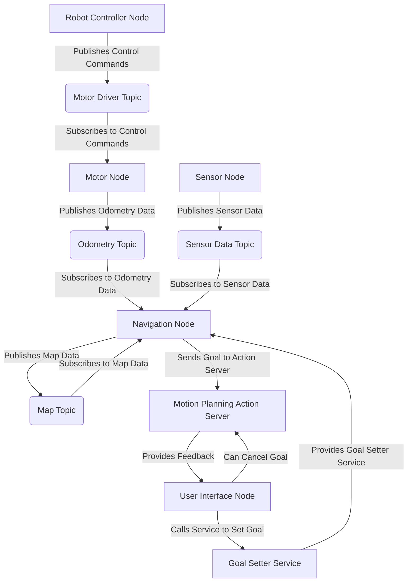

# Introduction to ROS 2: The Robotic Nervous System

Welcome to Module 1! In this module, we will explore the Robotic Operating System 2 (ROS 2), which serves as the "nervous system" for many advanced robotic applications, especially humanoid robots. ROS 2 provides a flexible framework for writing robot software, allowing different components of a robotic system to communicate and work together seamlessly.

## What is ROS 2?

ROS 2 is a set of software libraries and tools that help you build robot applications. From drivers to state-of-the-art algorithms, and with powerful developer tools, ROS has everything you need to start with your next robotics project. The "2" in ROS 2 signifies a significant re-architecture from its predecessor, ROS 1, primarily to support real-time systems, multi-robot systems, and to integrate with modern development practices more effectively.

### Key Concepts

Understanding ROS 2 revolves around several core concepts that facilitate modularity and distributed computing:

#### 1. Nodes

At the heart of ROS 2 are **nodes**. A node is an executable process that performs a specific task. For example, one node might be responsible for reading data from a camera, another for controlling a motor, and yet another for performing path planning. By breaking down complex robot functionalities into smaller, independent nodes, development becomes more manageable, and components can be reused across different projects.

#### 2. Topics

**Topics** are the most common way for nodes to asynchronously communicate with each other. A node can *publish* data to a topic, and other nodes can *subscribe* to that topic to receive the data. This publish-subscribe model is a one-to-many communication mechanism. For instance, a camera node might publish image data to an "image" topic, and an image processing node might subscribe to that topic to receive the images.

*   **Publisher**: A node that sends messages to a topic.
*   **Subscriber**: A node that receives messages from a topic.
*   **Message**: The data structure that is sent over a topic. ROS 2 uses predefined message types, but custom messages can also be created.

#### 3. Services

While topics are excellent for continuous, one-way data streams, sometimes you need a request/reply mechanism. This is where **services** come in. A service allows a node to send a request to another node and wait for a response. This is a synchronous, one-to-one communication pattern, useful for tasks that require a direct action and result, like requesting a robot to move to a specific position and confirming its arrival.

*   **Service Server**: A node that provides a service and processes requests.
*   **Service Client**: A node that sends a request to a service server and waits for a response.

#### 4. Actions

**Actions** are similar to services in that they provide a request/reply pattern, but they also offer continuous feedback and the ability to preempt (cancel) a goal. Actions are designed for long-running tasks, such as navigating a robot through a complex environment. A client can send a goal, receive intermittent feedback on its progress, and even cancel the goal if necessary.

*   **Action Server**: A node that provides an action, processes goals, and sends feedback.
*   **Action Client**: A node that sends a goal to an action server, receives feedback, and can cancel the goal.

## ROS 2 Architecture Overview

The overall architecture of a ROS 2 system often involves a collection of interconnected nodes communicating via topics, services, and actions. This distributed architecture makes ROS 2 highly flexible and scalable, allowing different parts of a robot's software to run on different machines or even different types of hardware.

This diagram illustrates a simplified ROS 2 system, showing how different nodes interact using various communication mechanisms.

## Conclusion

ROS 2 provides a powerful and flexible framework for developing complex robotic applications. By understanding its core concepts—nodes, topics, services, and actions—you gain the foundational knowledge to build and integrate sophisticated functionalities into your humanoid robots. In the next chapters, we will dive deeper into each of these concepts with practical Python examples.
