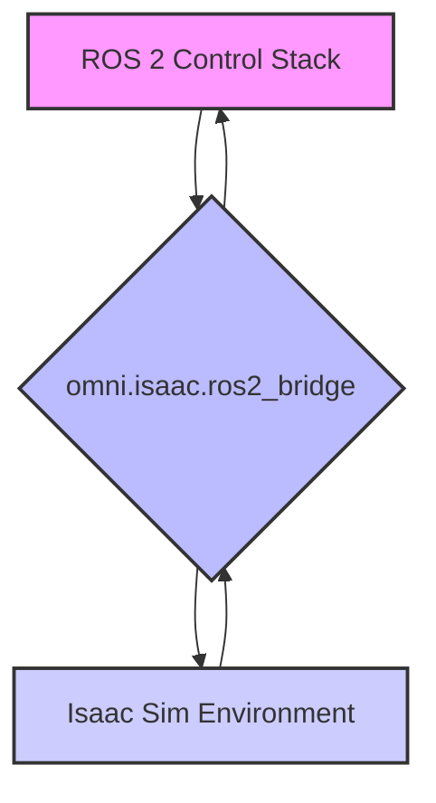

# ROS 2 Isaac Sim Integration: Bridging the Gap

A critical aspect of leveraging Isaac Sim for humanoid robotics is its seamless integration with ROS 2. This allows you to use your existing ROS 2-based control stacks, perception algorithms, and navigation frameworks with the high-fidelity simulation environment of Isaac Sim. This chapter explores how to bridge ROS 2 and Isaac Sim for comprehensive robot development.

<h2>1. The NVIDIA Isaac ROS Project</h2>

NVIDIA Isaac ROS is a collection of hardware-accelerated packages that make it easier to develop high-performance ROS 2 applications. When working with Isaac Sim, Isaac ROS provides optimized nodes and tools for common robotics tasks, including perception, navigation, and manipulation.

<h3>Key Features of Isaac ROS</h3>

*   **GPU Acceleration**: Leverages NVIDIA GPUs for computationally intensive tasks, significantly improving performance for deep learning and computer vision algorithms.
*   **Optimized ROS 2 Nodes**: Provides pre-built and optimized ROS 2 nodes for various functionalities (e.g., image processing, object detection, SLAM).
*   **Reference Applications**: Offers full reference applications that demonstrate best practices for integrating Isaac ROS components.

<h2>2. Bridging ROS 2 and Isaac Sim</h2>

Isaac Sim provides built-in mechanisms and extensions for ROS 2 communication, allowing you to establish a bidirectional flow of data between your ROS 2 nodes and the simulated environment.

<h3>Using `omni.isaac.ros2_bridge`</h3>

The `omni.isaac.ros2_bridge` extension within Isaac Sim is the primary tool for this integration. It allows you to:

*   **Publish Simulation Data to ROS 2**: Isaac Sim can publish joint states, sensor data (camera images, LiDAR scans, IMU data), and ground truth information to ROS 2 topics.
*   **Subscribe to ROS 2 Commands**: ROS 2 nodes can publish commands (e.g., joint commands, twist messages for base control) to topics that Isaac Sim subscribes to, controlling the simulated robot.
*   **Utilize ROS 2 Services and Actions**: Isaac Sim can expose services and actions that can be called by ROS 2 clients.

<h3>Conceptual Workflow: ROS 2 - Isaac Sim Bridge</h3>



<h2>3. Practical Integration Steps (Conceptual)</h2>

Integrating a robot with ROS 2 in Isaac Sim typically involves:

1.  **Load Robot Model**: Spawn your USD robot model into Isaac Sim.
2.  **Enable ROS 2 Bridge Extension**: Ensure `omni.isaac.ros2_bridge` is enabled in Isaac Sim.
3.  **Configure ROS 2 Interfaces**: Use the Isaac Sim GUI or Python scripts to configure which simulation topics should be published to ROS 2 and which ROS 2 topics Isaac Sim should subscribe to. This often involves mapping ROS 2 topic names and message types to their Isaac Sim equivalents.
4.  **Run ROS 2 Nodes**: Start your ROS 2 control, perception, or navigation nodes. These nodes will then communicate directly with the simulated robot in Isaac Sim.

<h3>Example: Publishing Joint States from Isaac Sim to ROS 2</h3>

When configured, Isaac Sim can automatically publish the joint states of your robot to a ROS 2 `/joint_states` topic.

```python
# Conceptual Python script to run within Isaac Sim for ROS 2 joint state publishing
# This typically happens via Isaac Sim extensions/UI configuration
# but conceptually involves:

from omni.isaac.core.articulations import Articulation
from omni.isaac.core.utils.nucleus import get_assets_root_path
from omni.isaac.core.utils.stage import add_reference_to_stage
from omni.isaac.core import World
import omni.isaac.ros2_bridge as ros2_bridge
import rclpy

# Assuming ROS 2 bridge is enabled and robot is loaded
# This is typically configured via UI or specific python scripts
# that setup the publishers and subscribers.

# Conceptual usage:
# ros2_node = rclpy.create_node('isaac_sim_ros_node')
# joint_state_publisher = ros2_node.create_publisher(JointState, '/joint_states', 10)

# In simulation update loop:
# msg = JointState()
# msg.header.stamp = ros2_node.get_clock().now().to_msg()
# msg.name = robot.dof_names
# msg.position = robot.get_joint_positions()
# joint_state_publisher.publish(msg)
```

<h2>4. Hardware-Accelerated Workflows with Isaac ROS</h2>

For performance-critical perception tasks (e.g., real-time object detection from a camera sensor in Isaac Sim), you can directly use Isaac ROS packages.

<h3>Example: Isaac ROS DNN for Object Detection</h3>

1.  **Isaac Sim publishes camera images**: Configure Isaac Sim to publish raw camera images from a simulated sensor to a ROS 2 topic (e.g., `/front_camera/image_raw`).
2.  **Isaac ROS DNN subscribes**: An Isaac ROS node (e.g., `isaac_ros_detectnet`) subscribes to this image topic, performs GPU-accelerated object detection, and publishes bounding box results to another ROS 2 topic.
3.  **ROS 2 control uses results**: Your robot's control node subscribes to the bounding box results to guide manipulation or navigation.

<h2>Conclusion</h2>

The integration of ROS 2 with NVIDIA Isaac Sim is a powerful combination for developing intelligent robotic systems. By leveraging the `omni.isaac.ros2_bridge` and Isaac ROS packages, developers can seamlessly connect high-fidelity simulation with robust ROS 2 software, accelerating the entire robotics development lifecycle.
